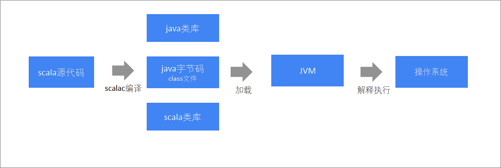
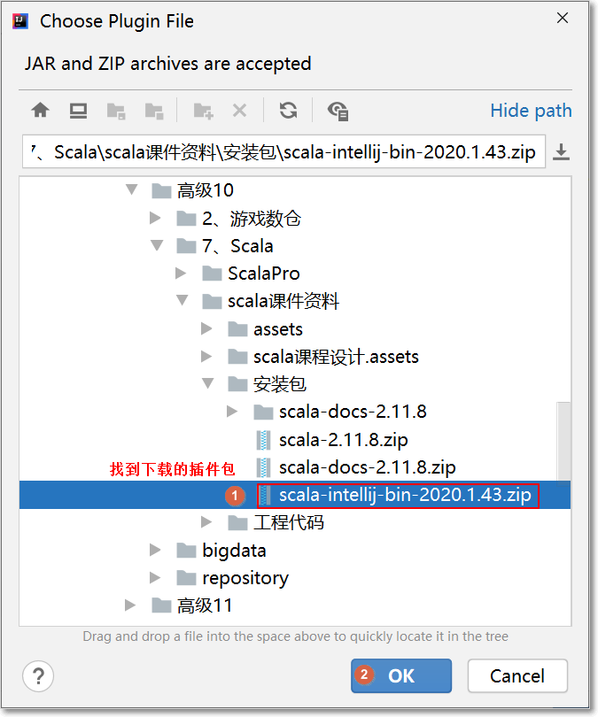
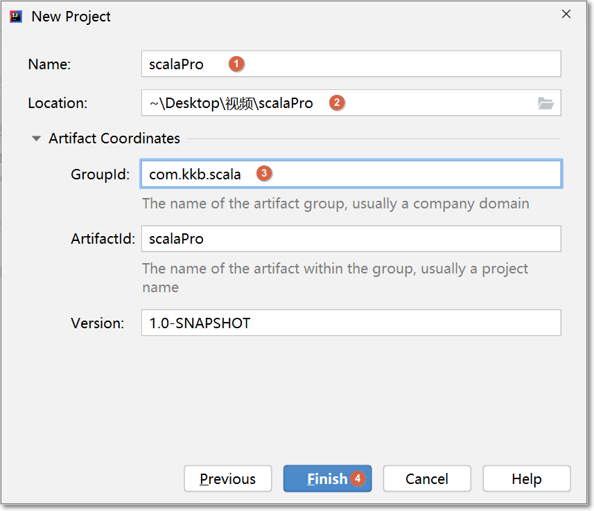
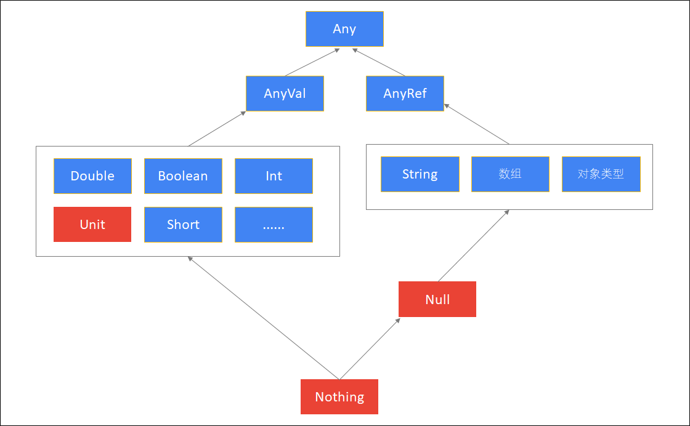

# scala语言课程设计


## 一、课前准备

* 1、安装好1.8 JDK环境


## 二、课堂主题

本堂课主要围绕  scala 基础语法进行讲解。主要包括以下几个方面

1. scala语言简介
2. scala开发环境搭建
3. scala的基础语法
4. scala的集合操作


## 三、课堂目标

1. 搭建scala开发环境
2. 掌握scala基本语法结构（变量、表达式、if、循环、方法、函数...）
3. 掌握scala集合使用（数组、元组、List、Set、Map...）


## 四、知识要点

### 1. scala简介

* scala是运行在 JVM 上的多范式编程语言，同时支持==面向对象==和==面向函数编程==
* scala大概是在==2003年==才正式诞生，而java的诞生可以追溯到1995年
* 早期scala刚出现的时候，并没有怎么引起重视，随着==Spark==(2010开源、2014成为apache顶级项目)和==Kafka==这样基于scala的大数据框架的兴起，scala逐步进入大数据开发者的眼帘。
* scala的主要优势是它的==表达性==。
* 官网地址
  * http://www.scala-lang.org

### 2. 为什么要使用scala

* 开发大数据应用程序（Spark程序、Flink程序）
* 表达能力强，一行代码抵得上Java多行，开发速度快
* 兼容Java，可以访问庞大的Java类库


### 3. 开发环境安装

* 学习如何编写scala代码之前，需要先安装scala编译器以及开发工具

  * Java程序编译执行流程

    

  * Scala程序编译执行流程

    

* scala程序运行需要依赖于Java类库，必须要有**==Java运行环境==**，scala才能正确执行

  * **要编译运行scala程序需要**
    * ==jdk  ( jvm )==
    * ==scala编译器（scala SDK）==


#### 3.1 安装JDK

~~~
安装JDK 1.8 64位版本，并配置好环境变量（配置过程略）
~~~


#### 3.2 安装scala SDK

~~~
scala SDK是scala语言的编译器，要开发scala程序，必须要先安装SDK
~~~

* 访问地址

  * <https://www.scala-lang.org/download/2.11.8.html>
  * 下载安装包==scala-2.11.8.zip==

  

* 在window在配置scala SDK，并配置好环境变量

  * 比如我将zip包解压到c盘
  * `我的电脑`->右键->`属性`

  

  

  

  

  

#### 3.3 安装IDEA的scala插件

>IDEA默认是不支持scala程序开发，所以需要来安装scala插件来支持scala语言。

* IDEA安装scala插件，可以选择在线安装，也可以离线安装
  * 因为在线安装，经常性由于网络原因，导致安装失败，所以此处以离线安装演示。
* 1、查看IDEA版本（==根据自己的IDEA版本，下载相应的scala插件==）


* 2、到IDEA官网下载相应版本的[IDEA scala插件](http://plugins.jetbrains.com/plugin/1347-scala)


- 比如下载的插件包是`scala-intellij-bin-2020.1.43.zip`

  ==请务必下载IDEA版本一致的scala插件==


* 3、接下来离线安装scala插件，此处以IDEA 2020.1版本演示





### 4. scala的REPL交互式解释器

#### 1. windos下面的REPL使用

* Scala提供的最重要的一个工具是交互模式（REPL）。==REPL是一个交互式解释器==，可以即时编译、运行代码并返回结果，方便前期做学习和测试
* 用法，输入help获得帮助信息

```
:help
```

* REPL

  * R(read)、E(evaluate) 、P（print）、L（loop）

* 要==启动scala解释器==，只需要以下几步：

  - 按住`windows键 + r`
  - 输入`scala`即可

  

* 退出scala解释器

  * 使用 ==:quit== 就可以了


#### 2. IDEA下的REPL交互式使用

- idea当中新建普通maven工程	


- 选择maven工程


- 填写groupId和ArtifactId  




- 修改pom.xml添加scala依赖以及编译插件

```xml
 <dependencies>
        <dependency>
            <groupId>org.scala-lang</groupId>
            <artifactId>scala-library</artifactId>
            <version>2.11.8</version>
            <!-- 如果想要用java -jar 来运行我们打包之后的jar包，则下面这个配置必须注释掉 -->
            <!-- <scope>provided</scope>-->
        </dependency>
    </dependencies>

    <build>
        <plugins>
            <!-- 限制jdk版本插件 -->
            <plugin>
                <groupId>org.apache.maven.plugins</groupId>
                <artifactId>maven-compiler-plugin</artifactId>
                <version>3.0</version>
                <configuration>
                    <source>1.8</source>
                    <target>1.8</target>
                    <encoding>UTF-8</encoding>
                </configuration>
            </plugin>
            <!-- 编译scala需要用到的插件 -->
            <plugin>
                <groupId>net.alchim31.maven</groupId>
                <artifactId>scala-maven-plugin</artifactId>
                <version>3.2.2</version>
                <executions>
                    <execution>
                        <goals>
                            <goal>compile</goal>
                            <goal>testCompile</goal>
                        </goals>
                    </execution>
                </executions>
            </plugin>
            <!-- 项目打包用到的插件 -->
            <plugin>
                <artifactId>maven-assembly-plugin</artifactId>
                <configuration>
                    <descriptorRefs>
                        <descriptorRef>jar-with-dependencies</descriptorRef>
                    </descriptorRefs>
                    <archive>
                        <manifest>
                            <mainClass></mainClass>
                        </manifest>
                    </archive>
                </configuration>
                <executions>
                    <execution>
                        <id>make-assembly</id>
                        <phase>package</phase>
                        <goals>
                            <goal>single</goal>
                        </goals>
                    </execution>
                </executions>
            </plugin>
        </plugins>
    </build>
```

- 刷新maven，等待依赖加载进来 


- 效果如下图


maven工程添加scala代码保存的source 文件夹


- 将scala标记为`Resources Root`


- 创建scala的workSheet


### 5. scala中声明变量

* **1、语法格式**

~~~scala
val/var 变量名称:变量类型 = 初始值
~~~
* 其中
  * `val`定义的是**不可重新赋值**的变量(值不可修改)
  * `var`定义的是**可重新赋值**的变量(值可以修改)
* ps
  * scala中声明变量是变量名称在前，变量类型在后，跟java是正好相反
  * scala的语句最后不需要添加分号

* **2、演示**

  ~~~scala
  //使用val声明变量,相当于java中的final修饰,不能在指向其他的数据了
   val  a:Int = 10
  
  //使用var声明变量,后期可以被修改重新赋值
   var  b:Int = 20	 
   b=100
  
  //scala中的变量的类型可以显式的声明,也可以不声明,如果不显式的声明这会根据变量的值来推断出来变量的类型(scala支持类型推断)
   val c = 20
  ~~~


* 3、**惰性变量**

  * Scala中使用==关键字lazy==来定义惰性变量，实现延迟加载(懒加载)。 
  * 惰性变量只能是==不可变变量==，并且只有在调用惰性变量时，才会去实例化这个变量。
  * 语法格式

  ~~~scala
  lazy val 变量名 = 表达式
  ~~~

  

​         

### 6. scala中数据类型

* scala中的类型绝大多数和Java一样
* 数据类型

| 基础类型 | 类型说明                 |
| -------- | ------------------------ |
| Byte     | 8位带符号整数            |
| Short    | 16位带符号整数           |
| **Int**  | 32位带符号整数           |
| Long     | 64位带符号整数           |
| Char     | 16位无符号Unicode字符    |
| String   | Char类型的序列（字符串） |
| Float    | 32位单精度浮点数         |
| Double   | 64位双精度浮点数         |
| Boolean  | true或false              |

* ==注意下 scala类型与Java的区别==

1. scala中所有的类型都使用==大写字母开头==
2. 整形使用Int而不是Integer
3. scala中定义变量可以不写类型，让scala==编译器自动推断==


* scala类型层次结构




| 类型    | 说明                                                         |
| ------- | ------------------------------------------------------------ |
| Any     | **所有类型**的父类，,它有两个子类AnyRef与AnyVal              |
| AnyVal  | **所有数值类型**的父类                                       |
| AnyRef  | 所有对象类型（引用类型）的父类                               |
| Unit    | 表示空，Unit是AnyVal的子类，它只有一个的实例（），它类似于Java中的void，但scala要比Java更加面向对象 |
| Null    | Null是AnyRef的子类，也就是说它是所有引用类型的子类。它的实例是null,   可以将null赋值给任何对象类型 |
| Nothing | 所有类型的**子类**不能直接创建该类型实例，某个方法抛出异常时，返回的就是Nothing类型，因为Nothing是所有类的子类，那么它可以赋值为任何类型 |

### 7.  scala中的条件表达式

* 条件表达式就是if表达式，if表达式可以根据给定的条件是否满足，根据条件的结果（真或假）决定执行对应的操作。scala条件表达式的语法和Java一样。

~~~scala
//定义变量x
scala> val x = 1
x: Int = 1

//if表达式
scala> val y = if(x > 0) 1 else -1
y: Int = 1

//支持混合类型表达式
scala> val z = if(x > 1) 1 else "error"
z: Any = error

//缺失else 相当于 if(x>2) 1 else ()
scala> val m = if(x > 2) 1
m: AnyVal = ()

//scala中有个Unit类，用作不返回任何结果的方法的结果类型,相当于Java中的void，Unit只有一个实例值，写成()
scala> val n = if(x > 2) 1 else ()
n: AnyVal = ()

//if(xx) else if(xx) val 
scala> val k = if(x < 0) -1 else if (x == 0) 0 else 1
k: Int = 1
~~~


### 8.scala方法的重载

+-*/%可以完成和Java中相同的工作，但是有一点区别，他们都是方法。你几乎可以用任何符号来为方法命名。

举例：

```
scala> 1 + 2
等同于：
scala> 1.+(2)
```


### 9. scala中的块表达式

* 定义变量时用 {} 包含一系列表达式，其中块的最后一个表达式的值就是块的值。

~~~scala
val x = 0 
val result = {
  val y = x + 10
  val z = y + "-hello"  
  val m = z + "-kaikeba"
  "over"
}
//result的值就是块表达式的结果    
//后期一个方法的返回值不需要加上return,把要返回的结果放在方法的最后一行就可以了 
~~~


* 在scala解释器中先输入 ==:paste== ,然后写多行代码, 之后按==ctrl+d==结束输入


### 10. 循环

~~~
在scala中，可以使用for和while，但一般推荐使用for表达式，因为for表达式语法更简洁
~~~

#### 1 for循环

* 1、语法结构

  ~~~scala
  for (i <- 表达式/数组/集合 if i条件){
      //表达式
  }
  ~~~

* 2、演示

  * 简单的for循环

  ~~~scala
  //简单的for循环
  scala> val nums= 1 to 10
  nums: scala.collection.immutable.Range.Inclusive = Range(1, 2, 3, 4, 5, 6, 7, 8, 9, 10)
  
  scala> for(i <- nums) println(i)
  1
  2
  3
  4
  5
  6
  7
  8
  9
  10
  
  ~~~

  * 双重for循环

  ~~~scala
  //双重for循环
  scala>  for(i <- 1 to 3; j <- 1 to 3) println(i*10+j)
  11
  12
  13
  21
  22
  23
  31
  32
  33
  
  //双重for循环打印99乘法表
  for(i <- 1 to 9; j <- 1 to i){
      print(i+"*"+j+"="+i*j+"\t")
       if(i==j){
         println()
      }    
  } 
  
  1*1=1
  2*1=2   2*2=4
  3*1=3   3*2=6   3*3=9
  4*1=4   4*2=8   4*3=12  4*4=16
  5*1=5   5*2=10  5*3=15  5*4=20  5*5=25
  6*1=6   6*2=12  6*3=18  6*4=24  6*5=30  6*6=36
  7*1=7   7*2=14  7*3=21  7*4=28  7*5=35  7*6=42  7*7=49
  8*1=8   8*2=16  8*3=24  8*4=32  8*5=40  8*6=48  8*7=56  8*8=64
  9*1=9   9*2=18  9*3=27  9*4=36  9*5=45  9*6=54  9*7=63  9*8=72  9*9=81
  ~~~

  * 守卫
    * 在for表达式中可以添加if判断语句，这个if判断就称为==守卫==
  * if为true，才会执行for语句的块
  
  ~~~scala
  //语法结构
  for(i <- 表达式/数组/集合 if 表达式) {
      // 表达式
  }
  
  scala> for(i <- 1 to 10 if i >5) println(i)
  6
  7
  8
  9
  10
  ~~~

  * for推导式
    * 在for循环体中，可以使用yield表达式构建出一个集合，我们把使用yield的for表达式称之为==推导式==

  ~~~scala
  // for推导式：for表达式中以yield开始，该for表达式会构建出一个集合
  
  val v = for(i <- 1 to 5) yield i * 10
  
  val v = for(i <- 1 to 5) yield {i * 10}
  ~~~


#### 2 while循环

* scala中while循环和Java中是一致的
* 语法结构

~~~scala
while(返回值为布尔类型的表达式){
    //表达式
}
~~~

* 演示

~~~scala
scala> var x = 10
x: Int = 10

scala> while(x >5){
     println(x)
     x -= 1
     }
10
9
8
7
6
~~~


### 11. 方法和函数

在scala当中，函数与方法是两个不同的概念，函数是scala当中的==一等公民==，scala是一门函数式的编程语言，同时兼顾了面向对象语言的特性。

1、方法与函数的定义方式不同

2、方法可以转换成为函数

3、函数就是对象

4、函数可以作为方法的参数

5、函数可以作为方法的返回值

#### 1 方法

* 语法

~~~scala
def methodName (参数名: 参数类型, 参数名: 参数类型) : [return type] = {
    // 方法体：一系列的代码
}
~~~


示例一：定义一个最标准的方法，且定义方法的返回值类型为Int类型

```scala
def hello(first: String, second: Int) :Int = {
  second
}

```

示例二：定义一个方法，且不定义返回值

注意：如果定义的方法没有返回值，那么方法的返回值会做==自动推断==。根据我们方法的最后一个返回类型来推断我们的方法返回类型

```scala
def  hello2(first: Int , second: String) = {
  //println(first)
  //20
}
val hello2Result = hello2(20,"abc")
println( hello2Result)
```

示例三：定义一个方法，不定义返回值，可以通过自动推断，返回不同类型的值

```scala
def hello3(first: Int, second: String) = {
  if(first > 10){
    first
  }else{
    second
  }
}
val hello3Result = hello3(5, "helloworld")
println(hello3Result)

```

示例四：定义一个方法，参数给定==默认值==，如果不传入参数，就使用默认值来代替

```scala
def hello4(first: Int = 10, second: String) = {
  println(first + "\t" + second)
}
//注意我们在调用方法的时候我们可以通过参数名来指定我们的参数的值
hello4(second = "helloworld")

```

示例五：变长参数，方法的参数个数不定的，类似于java当中的方法的...可变参数

```scala
def hello5(first: Int*) = {
  var result = 0;
  for(arg <- first){
    result  += arg
  }
  println(result)
}
hello5(10,20,30)
hello5(10,50)

```

 如果方法除了变长参数外，还有其他参数，那么变长参数必须在参数列表的最后，否则报错


```scala
def hello7(first: String, second: Int*) = {
  var result = 0;
  for (arg <- second) {
    result += arg
  }
  println(s"$first $result")
}

hello7("最后的和：", 1, 3, 5)
```


示例六：递归函数。我们可以定义一个方法，使得方法自己调用自己，形成一个递归函数，但是方法的==返回值类型必须显示的手动指定==

```scala
def  hello6(first: Int) :Int = {
  if(first <= 1){
    1
  }else{
    first * hello6(first - 1)
  }
}

val hello6Result = hello6(10)
println(hello6Result)

```

 

示例七：定义一个方法，没有显示的指定返回值，那么我们方法当中定义的等号可以省掉

注意：如果省掉了=号，那么这个方法强调的就是一个代码执行的==过程==

```scala
/**
  * 定义了一个方法，但是方法的返回值没有显示指定，
  * 此时我们就可以省掉方法定义的=号，如果省掉 = 号，
  * 那么这个方法强调的是一个过程，代码执行的过程，
  * 返回值是Unit，即()
  * @param first
  */
def hello7(first:Int){
  println(first)
  30
}
println(hello7(20))

```

示例八：直接通过def定义一个方法

```scala
def hello8 = 10
val hello8Result = hello8
println(hello8Result)
```

示例九：如果方法体当中只有一行代码，我们也可以省掉大括号

```scala
def hello10(first: Int, second: Int) = first + second
val hello10Result = hello10(10, 20)
println(hello10Result)

```

#### 2 函数

函数定义的两种形式

第一种形式：

```scala
val  函数名 = (参数名1：参数类型1，参数名2：参数类型2)  =>  {函数体}
```

第二种形式：

```scala
val  函数名:（参数类型1，参数类型2） => (返回类型) = {
  函数体
}
```

示例一：定义一个标准函数，使用 =>来进行定义

```scala
val func1 = (x: Int, y: Int) => {
   x + y
 }
 func1(2,8)
```


示例二：定义==匿名函数==。也就是我们可以定义一个没有名字的函数

定义一个匿名函数之后，这个函数就没法使用了

```scala
(x: Int, y: String) => {x + y}
```


示例三：以函数定义的第二种形式，定义一个函数，参数只有一个且是Int类型，返回值也是Int类型

```scala
val func3 :Int => Int = {x => x * x }
val func3Result = func3(10)
```

 

示例四：定义一个函数，参数值是两个，分别是Int和String，返回值是一个元组，分别是String和Int

```scala
val func4: (Int, String) => (String, Int) = {
   (x, y) => (y, x)
 }
 val func4Result = func4(10,"hello")
 println(func4Result)
```

#### 3 方法和函数的区别

* 方法是隶属于类或者对象的，在运行时，它是加载到JVM的==方法区==中
* 可以将函数对象赋值给一个变量，在运行时，它是加载到==JVM的堆内存==中
* ==函数是一个对象，继承自FunctionN==，函数对象有apply，curried，toString，tupled这些方法，而方法则没有


#### 4 方法转换为函数

* 有时候需要将方法转换为函数，作为变量传递，就需要将方法转换为函数
* 使用`_`即可将方法转换为函数

* 示例

  ~~~scala
  scala> def add(x: Int, y: Int) = x + y
  add: (x: Int, y: Int)Int
  
  scala> val a = add _
  a: (Int, Int) => Int = <function2>	//a是一个函数
  ~~~


### 12、scala中的集合

>所有集合都扩展自==Iterable特质==
>
>Iterable只那些能生成Iterator，进而访问每个元素的集合
>
>val arr = Array(1, 2)
>while(iter.hasNext){
>	println(iter.next())
>}


>集合有3大类：序列Seq、集Set、映射Map

#### 1.集合基本介绍

- Scala同时支持==可变集合和不可变集合==
  - 不可变集合从不可变，可以安全的并发访问。

- 两个主要的包：
  - 不可变集合：scala.collection.immutable
  - 可变集合：  scala.collection.mutable

- Scala优先采用不可变集合
- 对于几乎所有的集合类，Scala都同时提供了可变和不可变的版本。

**不可变集合继承层次：**


**可变集合继承层次：**


#### 2. 数组

> Seq是有先后次序的集合，如Array、List

* scala中数组的概念是和Java类似，可以用数组来存放一组数据
* scala中，有两种数组
  * 一种是**定长数组**
  * 另一种是**变长数组**


##### 1 定长数组

* 定长数组指的是数组的==**长度**是**不允许改变**==的

* 数组的==**元素**是**可以改变**==的

* 语法

  ~~~scala
  // 通过指定长度定义数组
  val/var 变量名 = new Array[元素类型](数组长度)
  
  // 用元素直接初始化数组
  val/var 变量名 = Array(元素1, 元素2, 元素3...)
  ~~~

* 注意

  ~~~scala
  在scala中，数组的泛型使用[]来指定
  使用()来获取元素
  ~~~

* 演示

  ~~~scala
  scala> val a = new Array[Int](5)
  a: Array[Int] = Array(0, 0, 0, 0, 0)
  
  //思考题：是否可行？
  a = Array(1, 2, 3)
  
  scala> a(0)
  res19: Int = 0
  
  //不可变数组的元素可以修改
  scala> a(0) = 10
  
  scala> a
  res21: Array[Int] = Array(10, 0, 0, 0, 0)
  
  //在数组前增加元素;+:是一个方法（以:结尾的操作符都是右结合的）
  scala> 0 +: a
  res61: Array[Int] = Array(0, 10, 0, 0, 0, 0)
  //原集合a不变，生成新的Array
  scala> a
  res68: Array[Int] = Array(10, 0, 0, 0, 0)
  //在数组后边增加元素
  scala> a :+ 3
  res69: Array[Int] = Array(10, 0, 0, 0, 0, 3)
  //在前边增加另外一个集合
  scala> List(5, 6) ++: a
  //等价于
  List(5, 6) ++ a
  
  scala> a
  res70: Array[Int] = Array(10, 0, 0, 0, 0)
  
  
  //////////////////////////////////////////////////////////////////
  scala> val b = Array("hadoop", "spark", "hive")
  b: Array[String] = Array(hadoop, spark, hive)
  
  scala> b(0)
  res24: String = hadoop
  
  scala> b.length
  res25: Int = 3
  ~~~


##### 2 变长数组

* 变长数组指的是数组的==长度是可变的，可以往数组中添加、删除元素==

* 创建变长数组，需要提前导入ArrayBuffer类

  ~~~scala
  import scala.collection.mutable.ArrayBuffer
  ~~~

* 语法

  * 创建空的ArrayBuffer变长数组

  ~~~scala
  val/var a = ArrayBuffer[元素类型]()
  ~~~

  * 创建带有初始元素的ArrayBuffer

  ~~~scala
  val/var a = ArrayBuffer(元素1，元素2，元素3....)
  ~~~

* 演示

  ~~~scala
  //导入ArrayBuffer类型
  scala> import scala.collection.mutable.ArrayBuffer
  import scala.collection.mutable.ArrayBuffer
  
  //定义一个长度为0的整型变长数组
  scala> val a = ArrayBuffer[Int]()
  a: scala.collection.mutable.ArrayBuffer[Int] = ArrayBuffer()
  
  //定义一个有初始元素的变长数组
  scala> val b = ArrayBuffer("hadoop", "storm", "spark")
  b: scala.collection.mutable.ArrayBuffer[String] = ArrayBuffer(hadoop, storm, spark)
  ~~~

* 变长数组的增删改操作

  - 使用`+=`添加元素
  - 使用`-=`删除元素
  - 使用`++=`追加一个数组到变长数组

* 示例

  ~~~scala
  // 定义变长数组
  scala> val a = ArrayBuffer("hadoop", "spark", "flink")
  a: scala.collection.mutable.ArrayBuffer[String] = ArrayBuffer(hadoop, spark, flink)
  
  // 追加一个元素
  scala> a += "flume"
  res10: a.type = ArrayBuffer(hadoop, spark, flink, flume)
  
  // 删除一个元素
  scala> a -= "hadoop"
  res11: a.type = ArrayBuffer(spark, flink, flume)
  
  a += "oozie" -= "spark" //返回ArrayBuffer.this.type类型
  
  // 追加一个数组
  scala> a ++= Array("hive", "sqoop")
  res12: a.type = ArrayBuffer(spark, flink, flume, hive, sqoop)
  
  //扩展：在前边追加元素或集合 
  scala> "spark" +=: a
  res49: a.type = ArrayBuffer(spark, flink, flume, oozie, hive, sqoop)
  //上边的代码，像其他以:结尾的操作符一样， +=:是右结合的，是右操作元a的方法，即上边代码本质上是这样子的
  a -= "spark"
  scala> a.+=:("spark")
  res51: a.type = ArrayBuffer(spark, flink, flume, oozie, hive, sqoop)
  
  //在a前边追加集合
  scala> List("scala", "java") ++=: a
  res53: a.type = ArrayBuffer(scala, java, spark, flink, flume, oozie, hive, sqoop)
  //相似的，等价于
  scala> a --= List("scala", "java")
  res54: a.type = ArrayBuffer(spark, flink, flume, oozie, hive, sqoop)
  scala> a.++=:(List("scala", "java"))
  res55: a.type = ArrayBuffer(scala, java, spark, flink, flume, oozie, hive, sqoop)
  
  //---------------------------------------
  //任意位置插入、删除元素；不高效，原因？
  a.insert(1, "ai")	//在index 1之前插入元素
  
  //插入多个
  a.insert(1, "ml", "graphx")
  
  //移除一个
  a.remove(1)
  
  //移除多个；第二个参数：移除的元素个数
  a.remove(2, 2)
  
  
  //移除最后2个元素；高效
  a.trimEnd(2)
  
  println(a.toString)
  
  //技巧：如果要定义一个Array，但元素个数不确定，可以先将元素写入一个ArrayBuffer，然后再将ArrayBuffer转换成Array
  a.toArray
  
  //相似的，可以将Array转换成ArrayBuffer
  val arr00 = Array(1, 2, 3)
  arr00.toBuffer
  
  //scala集合可以与java集合互转
  
  ~~~


##### 3. 遍历数组

* 可以使用以下两种方式来遍历数组：
  * 使用==for表达式== 直接遍历数组中的元素
  * 使用 ==索引== 遍历数组中的元素

* 示例

~~~scala
scala> for(i <- a) println(i)
hadoop
hive
flume
spark

scala> for(i <- 0 to a.length -1 ) println(a(i))
hadoop
hive
flume
spark

scala> for(i <- 0 until a.length) println(a(i))
hadoop
hive
flume
spark


//0 until n ——生成一系列的数字，包含0，不包含n
//0 to n    ——包含0，也包含n
for(i <- 0 until (a.length, 2)) println(a(i))
~~~


##### 4 数组常用操作

* scala中的数组封装了丰富的计算操作，将来在对数据处理的时候，不需要我们自己再重新实现。
  * 求和——sum方法
  * 求最大值——max方法 
  * 求最小值——min方法 
  * 排序——sorted方法
* 示例

~~~scala
scala> val array = Array(1,3,4,2,5)
array: Array[Int] = Array(1, 3, 4, 2, 5)

//求和
scala> array.sum
res10: Int = 15

//求最大值
scala> array.max
res11: Int = 5

//求最小值
scala> array.min
res12: Int = 1

//求乘积
array.product

//生成新的数组，升序;原集合array保持不变
scala> array.sorted
res13: Array[Int] = Array(1, 2, 3, 4, 5)

//降序    reverse 反转
scala> array.sorted.reverse
res14: Array[Int] = Array(5, 4, 3, 2, 1)

val array01 = Array("Hello", "Spark", "Flink", "Kafka")
array01.min
array01.max

~~~


#### 3. 元组

* 元组可以用来包含一组不同类型的值。例如：姓名，年龄，性别，出生年月。元组的元素是不可变 的。

##### 1 定义元组

* 语法

  * 使用括号来定义元组

    ~~~scala
    val/var 元组变量名称 = (元素1, 元素2, 元素3....)
    ~~~

  * 使用箭头来定义元素（元组只有两个元素）

    ~~~scala
    val/var 元组 = 元素1->元素2
    ~~~

- 元组中的==元素不能修改==

##### 2 示例

~~~scala
// 可以直接使用括号来定义一个元组 
scala> val a = (1, "张三", 20, "北京市") 
a: (Int, String, Int, String) = (1,张三,20,北京市)

//使用箭头来定义元素
scala> val b = 1 -> 2 
b: (Int, Int) = (1,2)

val c = (1, 2)
~~~


##### 3 访问元组

* 使用

  ```
   _1、_2、_3....
  ```

  来访问元组中的元素，_1表示访问第一个元素，依次类推

* 示例

~~~scala
scala> val a = (1, "张三", 20, "北京市")
a: (Int, String, Int, String) = (1,张三,20,北京市)

//获取元组中的第一个元素
scala> a._1
res18: Int = 1

//获取元组中的第二个元素
scala> a._2
res19: String = 张三

//获取元组中的第三个元素
scala> a._3
res20: Int = 20

//获取元组中的第四个元素
scala> a._4
res21: String = 北京市

//不能修改元组中的值
scala> a._4 = "上海"
<console>:12: error: reassignment to val
       a._4="上海"
           ^
~~~

#### 4. 映射Map

* Map可以称之为映射。它是由键值对组成的集合。
* scala当中的Map集合与java当中的Map类似，也是key，value对形式的。
* 在scala中，Map也分为==不可变Map和可变 Map==。


##### 1 不可变Map

* 定义语法；==值不可改变，否则报错==

~~~scala
val/var map = Map(键->值, 键->值, 键->值...)    // 推荐，可读性更好 
val/var map = Map((键, 值), (键, 值), (键, 值), (键, 值)...)
~~~

* 演示

~~~scala
scala> val map1 = Map("zhangsan"->30, "lisi"->40) 
map: scala.collection.immutable.Map[String,Int] = Map(zhangsan -> 30, lisi -> 40)

scala> val map2 = Map(("zhangsan", 30), ("lisi", 30)) 
map: scala.collection.immutable.Map[String,Int] = Map(zhangsan -> 30, lisi -> 30)
// 根据key获取value 
scala> map1("zhangsan") 
res10: Int = 30

map1("zhangsan") = 20 //报错
<console>:16: error: value update is not a member of scala.collection.immutable.Map[String,Int]
       map1("zhangsan") = 20
       ^

~~~


##### 2 可变Map

* 可变Map需要手动导入==import scala.collection.mutable.Map==, 定义语法与不可变Map一致。

* 演示

~~~scala
//导包
scala> import scala.collection.mutable.Map
import scala.collection.mutable.Map

//定义可变的map
scala> val map3 = Map("zhangsan"->30, "lisi"->40)
map3: scala.collection.mutable.Map[String,Int] = Map(lisi -> 40, zhangsan -> 30)

//获取zhangsan这个key对应的value
scala> map3("zhangsan")
res26: Int = 30

//给zhangsan这个key重新赋值value
scala> map3("zhangsan") = 50

//显示map3
scala> map3
res28: scala.collection.mutable.Map[String,Int] = Map(lisi -> 40, zhangsan -> 50)

~~~


##### 3 Map基本操作

* 创建一个可变的map

~~~scala
//导包
scala> import scala.collection.mutable.Map
import scala.collection.mutable.Map

scala> val map = Map("zhangsan"->30, "lisi"->40) 
map: scala.collection.mutable.Map[String,Int] = Map(lisi -> 40, zhangsan -> 30)
~~~

* 按照key获取value

~~~scala
// 获取zhagnsan的年龄 
scala> map("zhangsan")
res10: Int = 30

map("wangwu") //不存在，报错

if(map.contains("wangwu")) map.get("wangwu") else println("does not contain wangwu")

// 获取wangwu的年龄，如果wangwu不存在，则返回-1 比较友好，避免遇到不存在的key而报错
scala> map.getOrElse("wangwu", -1) 
res11: Int = -1

~~~

* 修改key对应的value

~~~scala
scala> map("lisi")=50
~~~


* 添加key-value键值对

~~~scala
scala> map += ("wangwu" ->35)
res12: map.type = Map(lisi -> 50, zhangsan -> 30, wangwu -> 35)
//添加、更新多个键值对
map += ("wangwu" ->25, "lisi" -> 10)

//等价
map("wangwu") = 35

~~~


* 删除key-value键值对

~~~scala
scala> map -= "wangwu"
res13: map.type = Map(lisi -> 50, zhangsan -> 30)
~~~


* 获取所有的key和所有的value

~~~scala
//获取所有的key
scala> map.keys
res36: Iterable[String] = Set(lisi, zhangsan)

//获取所有的key
scala> map.keySet
res37: scala.collection.Set[String] = Set(lisi, zhangsan)

//获取所有的value
scala> map.values
res38: Iterable[Int] = HashMap(50, 30)
~~~


* 遍历map

~~~scala
//第一种遍历
scala> for(k <- map.keys) println(k+" -> " + map(k))
lisi -> 50
zhangsan -> 30


//第二种遍历
scala> for((k,v) <- map) println(k+" -> "+v)
lisi -> 50
zhangsan -> 30
~~~


#### 5. Set集合

* Set是代表==没有重复元素、没有先后顺序==的集合。
* Set具备以下性质：
  * 1、元素不重复 
  * 2、不保证插入顺序
* 如果想要保留Set中元素插入的顺序，可以使用**LinkedHashSet**
* scala中的set集合也分为两种
  * 一种是不可变集合
  * 另一种是可变集合。


##### 1 不可变Set集合

* 语法

~~~scala
//创建一个空的不可变集
val/var 变量名 = Set[类型]()

//给定元素来创建一个不可变集
val/var 变量名 = Set[类型](元素1, 元素2, 元素3...)

~~~

* 演示

~~~scala
// 创建set集合 
scala> val a = Set(1,1,2,3,4,5) 
a: scala.collection.immutable.Set[Int] = Set(5, 1, 2, 3, 4)

//判断包含某元素（中置表示法）
scala> a contains 1
res14: Boolean = true
//等价于
a.contains(1)

//判断是否是另外一个Set的子集（中置表示法）
scala> Set(1, 2) subsetOf a
res15: Boolean = true
//等价于
Set(1, 2).subsetOf(a)

//集的并、交、差
scala> val b = Set(2,3,6) 
b: scala.collection.immutable.Set[Int] = Set(2, 3, 6)
//并
scala> a | b
res22: scala.collection.immutable.Set[Int] = Set(5, 1, 6, 2, 3, 4)
//等价
scala> a union b
res24: scala.collection.immutable.Set[Int] = Set(5, 1, 6, 2, 3, 4)
scala> a ++ b
res30: scala.collection.immutable.Set[Int] = Set(5, 1, 6, 2, 3, 4)
//交
scala> a & b
res25: scala.collection.immutable.Set[Int] = Set(2, 3)
//等价
scala> a intersect b
res26: scala.collection.immutable.Set[Int] = Set(2, 3)
//差
scala> a diff b
res27: scala.collection.immutable.Set[Int] = Set(5, 1, 4)

scala> a &~ b
res28: scala.collection.immutable.Set[Int] = Set(5, 1, 4)

scala> a -- b
res29: scala.collection.immutable.Set[Int] = Set(5, 1, 4)

// 获取集合的大小 
scala> a.size 
res0: Int = 5

// 遍历集合
scala> for(i <- a) println(i)

//添加元素生成新的集合
scala> a + 6
res1: scala.collection.immutable.Set[Int] = Set(5, 1, 6, 2, 3, 4)

// 删除一个元素 
scala> a - 1 
res2: scala.collection.immutable.Set[Int] = Set(5, 2, 3, 4)

// 删除set集合中存在的元素 
scala> a -- Set(2,3) 
res3: scala.collection.immutable.Set[Int] = Set(5, 1, 4)

// 拼接两个集合 
scala> a ++ Set(6,7,8) 
res4: scala.collection.immutable.Set[Int] = Set(5, 1, 6, 2, 7, 3, 8, 4)


//注意：这里对不可变的set集合进行添加删除等操作，对于该集合来说是没有发生任何变化，这里是生成了新的集合，新的集合相比于原来的集合来说发生了变化。
~~~


##### 2 可变Set集合

* 要使用可变集，必须要手动导入： ==import scala.collection.mutable.Set==
* 演示

~~~scala
//导包
scala> import scala.collection.mutable.Set
import scala.collection.mutable.Set

//定义可变的set集合
scala> val set=Set(1,2,3,4,5)
set: scala.collection.mutable.Set[Int] = Set(1, 5, 2, 3, 4)

//添加单个元素
scala> set += 6 // set = set + 6
res10: set.type = Set(1, 5, 2, 6, 3, 4)

//添加多个元素
scala> set += (6,7,8,9)
res11: set.type = Set(9, 1, 5, 2, 6, 3, 7, 4, 8)

//添加一个set集合中的元素
scala> set ++= Set(10,11)
res12: set.type = Set(9, 1, 5, 2, 6, 3, 10, 7, 4, 11, 8)

//删除一个元素
scala> set -= 11
res13: set.type = Set(9, 1, 5, 2, 6, 3, 10, 7, 4, 8)

//删除多个元素
scala> set -= (9,10)
res15: set.type = Set(1, 5, 2, 6, 3, 7, 4, 8)

//删除一个set子集
scala> set --= Set(7,8)
res19: set.type = Set(1,5, 2, 6, 3, 4)

//将值1从set中删除
scala> set.remove(1)
res17: Boolean = true

scala> set
res18: scala.collection.mutable.Set[Int] = Set(5, 2, 6, 3, 4)

~~~


#### 6. 列表 List

* List是scala中最重要的、也是最常用的数据结构。
* List具备以下性质：
  * 1、可以保存重复的值 
  * 2、有先后顺序
* 在scala中，也有两种列表
  * 一种是不可变列表
  * 另一种是可变列表


##### 1 不可变列表

* 不可变列表就是列表的元素、长度都是不可变的
* 语法
  * 使用 List(元素1, 元素2, 元素3, ...) 来创建一个不可变列表，语法格式

~~~scala
val/var 变量名 = List(元素1, 元素2, 元素3...)

//使用 Nil 创建一个不可变的空列表
val/var 变量名 = Nil

//使用 :: 方法创建一个不可变列表
val/var 变量名 = 元素1 :: 元素2 :: Nil

~~~

* 演示

~~~scala
//创建一个不可变列表，存放以下几个元素（1,2,3,4）
scala> val  list1=List(1,2,3,4)
list1: List[Int] = List(1, 2, 3, 4)

//使用Nil创建一个不可变的空列表
scala> val  list2 = Nil
list2: scala.collection.immutable.Nil.type = List()

//::以给定的head、tail创建List；::是右结合
val list4 = 4 :: List(3, 2, 3)
res1: List[Int] = List(4, 3, 2, 3)
//等价于
scala> List(3, 2, 3).::(4)
res2: List[Int] = List(4, 3, 2, 3)
//等价于
scala> val list4 = 4 +: List(3, 2, 3)
list4: List[Int] = List(4, 3, 2, 3)

//在List尾部增加元素
scala> val list4 = List(3, 2, 3) :+ 4
list4: List[Int] = List(3, 2, 3, 4)

//使用 :: 方法创建列表，包含1、2、3三个元素
scala> val list3 = 1 :: 2 :: 3 :: Nil
list3: List[Int] = List(1, 2, 3)

//::是右结合的，列表从尾部开始构建；上边的list3等价于
val list3 = (1 :: (2 :: (3 :: Nil)))
//3 :: Nil == Nil.::(3)

//将一个List添加到另外一个List头部
scala> val a = List(1, 2)
a: List[Int] = List(1, 2)

scala> val b = List(-1, 0)
b: List[Int] = List(-1, 0)
scala> 0 :: a
res31: List[Int] = List(0, 1, 2)

scala> b :: a
res32: List[Any] = List(List(-1, 0), 1, 2)
//
scala> b ::: a
res33: List[Int] = List(-1, 0, 1, 2)
//等价于
b ++: a

~~~


##### 2 可变列表

* 可变列表就是列表的元素、长度都是可变的。
* 要使用可变列表，先要导入 ==import scala.collection.mutable.ListBuffer==

* 语法

  * 使用ListBuffer[元素类型]() 创建空的可变列表，语法结构

  ~~~scala
  val/var 变量名 = ListBuffer[Int]()
  ~~~

  * 使用ListBuffer(元素1, 元素2, 元素3...)创建可变列表，语法结构

  ~~~scala
  val/var 变量名 = ListBuffer(元素1，元素2，元素3...)
  ~~~

* 演示

  ~~~scala
  //导包
  scala> import scala.collection.mutable.ListBuffer
  import scala.collection.mutable.ListBuffer
  
  //定义一个空的可变列表
  scala> val a=ListBuffer[Int]()
  a: scala.collection.mutable.ListBuffer[Int] = ListBuffer()
  
  //定义一个有初始元素的可变列表
  scala> val b=ListBuffer(1,2,3,4)
  b: scala.collection.mutable.ListBuffer[Int] = ListBuffer(1, 2, 3, 4)
  ~~~


##### 3 列表操作

~~~scala
//导包
scala> import scala.collection.mutable.ListBuffer
import scala.collection.mutable.ListBuffer

//定义一个可变的列表
scala> val list=ListBuffer(1,2,3,4)
list: scala.collection.mutable.ListBuffer[Int] = ListBuffer(1, 2, 3, 4)

//获取第一个元素
scala> list(0)
res4: Int = 1
//获取第一个元素
scala> list.head
res5: Int = 1

//获取除了第一个元素外其他元素组成的列表(所有Iterable都有，比如Array)
scala> list.tail
res6: scala.collection.mutable.ListBuffer[Int] = ListBuffer(2, 3, 4)

//返回除最后一个元素外的所有元素(所有Iterable都有)
list.init

//获得头n个元素(所有Iterable都有)
scala> list.take(2)
res92: scala.collection.mutable.ListBuffer[Int] = ListBuffer(1, 2)

//获得除头n个元素外的其他元素(所有Iterable都有)
scala> list.drop(2)
res93: scala.collection.mutable.ListBuffer[Int] = ListBuffer(3, 4)
//(所有Iterable都有)
scala> list.splitAt(2)
res94: (scala.collection.mutable.ListBuffer[Int], scala.collection.mutable.ListBuffer[Int]) = (ListBuffer(1, 2),ListBuffer(3, 4))
//返回从n到m（不包括）的元素
scala> list.slice(1, 3)
res95: scala.collection.mutable.ListBuffer[Int] = ListBuffer(2, 3)
//(所有Iterable都有)
scala> list.zip(List(1, 2))
res97: scala.collection.mutable.ListBuffer[(Int, Int)] = ListBuffer((1,1), (2,2))
//(所有Iterable都有)
scala> list.zipWithIndex
res96: scala.collection.mutable.ListBuffer[(Int, Int)] = ListBuffer((1,0), (2,1), (3,2), (4,3))

//添加单个元素
scala> list +=5
res7: list.type = ListBuffer(1, 2, 3, 4, 5)

//添加一个不可变的列表
scala> list ++=List(6,7)
res8: list.type = ListBuffer(1, 2, 3, 4, 5, 6, 7)

//添加一个可变的列表
scala> list ++=ListBuffer(8,9)
res9: list.type = ListBuffer(1, 2, 3, 4, 5, 6, 7, 8, 9)

//删除单个元素
scala> list -=9
res10: list.type = ListBuffer(1, 2, 3, 4, 5, 6, 7, 8)

//删除一个不可变的列表存在的元素
scala> list --=List(7,8)
res11: list.type = ListBuffer(1, 2, 3, 4, 5, 6)

//删除一个可变的列表存在的元素
scala> list --=ListBuffer(5,6)
res12: list.type = ListBuffer(1, 2, 3, 4)

//可变的列表转为不可变列表
scala> list.toList
res13: List[Int] = List(1, 2, 3, 4)

//可变的列表转为不可变数组
scala> list.toArray
res14: Array[Int] = Array(1, 2, 3, 4)
~~~


> 总结：
>
> +将元素添加到无先后次序的集合Set中
>
> :+向后、+:向前追加元素到序列
>
> -用于移除元素
>
> ++、--用于批量添加或删除
>
> 对于列表List，优先使用::和:::
>
> ==可变集合==的改值操作有+=、++=、-=、--=

### 13. 函数式编程

* 我们将来使用Spark/Flink的大量业务代码都会使用到函数式编程。
* 下面的这些操作是学习的重点，先来感受下如何进行函数式编程以及它的强大

- Iterable trait有如下常用的方法

#### 1 遍历 - foreach

* 方法描述

  ~~~scala
  foreach(f: (A) ⇒ Unit): Unit
  Applies a function f to all elements of this immutable iterable collection.
  ~~~

* 方法说明

  | foreach | API           | 说明                                                         |
  | ------- | ------------- | ------------------------------------------------------------ |
  | 参数    | f: (A) ⇒ Unit | 接收一个函数对象<br />函数的输入参数为集合的元素<br />返回值为空 |
  | 返回值  | Unit          | 空                                                           |

* 方法实操

~~~scala
scala> val list=List(1,2,3,4)
list: List[Int] = List(1, 2, 3, 4)

//定义一个匿名函数传入到foreach方法中；将f依次应用到集合的每个元素
scala> list.foreach((x:Int)=>println(x))
1
2
3
4

//匿名函数的输入参数的“类型”可以省略，由编译器自动推断
scala> list.foreach(x=>println(x))
1
2
3
4

//当函数有一个参数，只在函数体中出现一次，而且函数体没有嵌套调用时，可以使用下划线来简化函数定义
scala> list.foreach(println(_))
1
2
3
4

//最简写，直接给定println
scala> list.foreach(println)
1
2
3
4

//很神奇的语法，别害怕，盘它就可以了，后期通过scala语言开发spark、Flink程序非常简洁方便
~~~


#### 2 映射 - map

* 集合的映射操作是将来在编写Spark/Flink用得最多的操作，是我们必须要掌握的掌握。

* 方法描述

~~~scala
def map[B](f: (A) ⇒ B): TraversableOnce[B]
~~~

* 方法说明

| map方法 | API                | 说明                                                         |
| ------- | ------------------ | ------------------------------------------------------------ |
| 泛型    | [B]                | 指定map方法最终返回的集合泛型                                |
| 参数    | f: (A) ⇒ B         | 传入一个函数对象<br />该函数接收一个类型A（要转换的列表元素）<br />返回值为类型B |
| 返回值  | TraversableOnce[B] | B类型的集合                                                  |

* 方法实操

~~~scala
//定义一个list集合，实现把内部每一个元素做乘以10，生成一个新的list集合
scala> val list=List(1,2,3,4)
list: List[Int] = List(1, 2, 3, 4)

//定义一个匿名函数
scala> list.map((x:Int)=>x*10)
res21: List[Int] = List(10, 20, 30, 40)

//省略匿名函数参数类型
scala> list.map(x=>x*10)
res22: List[Int] = List(10, 20, 30, 40)

//最简写   用下划线
scala> list.map(_*10)
res23: List[Int] = List(10, 20, 30, 40)
~~~

#### 3 扁平化映射 - flatMap

* 映射扁平化也是将来用得非常多的操作，也是必须要掌握的。
* 如何作为参数的函数应用到集合的每个元素，每次应用的时候，都产生一个集合，并且向将这些集合的元素拼接在一起，可以使用flatMap
* 方法描述

~~~scala
def flatMap[B](f: (A) ⇒ GenTraversableOnce[B]): TraversableOnce[B]
~~~

* 方法说明

| flatmap方法 | API                            | 说明                                                         |
| ----------- | ------------------------------ | ------------------------------------------------------------ |
| 泛型        | [B]                            | 最终要转换的集合元素类型                                     |
| 参数        | f: (A) ⇒ GenTraversableOnce[B] | 传入一个函数对象<br />函数的参数是集合的元素<br />函数的返回值是一个集合 |
| 返回值      | TraversableOnce[B]             | B类型的集合                                                  |

* 方法实操

~~~scala
//定义一个List集合,每一个元素中就是一行数据，有很多个单词
scala>  val list = List("hadoop hive spark flink", "hbase spark")
list: List[String] = List(hadoop hive spark flink, hbase spark)

scala> list.map(_.split(" "))
res2: List[Array[String]] = List(Array(hadoop, hive, spark, flink), Array(hbase, spark))

//flatten将多个集合的元素压到一起
scala> list.map(_.split(" ")).flatten
res3: List[String] = List(hadoop, hive, spark, flink, hbase, spark)

//等价于
//使用flatMap进行偏平化处理，获取得到所有的单词； flatMap该方法其本质是先进行了map 然后又调用了flatten
scala> list.flatMap(x => x.split(" "))
res24: List[String] = List(hadoop, hive, spark, flink, hbase, spark)

//简写
scala> list.flatMap(_.split(" "))
res25: List[String] = List(hadoop, hive, spark, flink, hbase, spark)

~~~


#### 4 过滤 - filter

* 过滤符合一定条件的元素

- 方法描述

```scala
def filter(p: (A) ⇒ Boolean): TraversableOnce[A]
```

- 方法说明

| filter方法 | API                | 说明                                                         |
| ---------- | ------------------ | ------------------------------------------------------------ |
| 参数       | p: (A) ⇒ Boolean   | 传入一个函数对象<br />接收一个集合类型的参数<br />返回布尔类型，满足条件返回true, 不满足返回false |
| 返回值     | TraversableOnce[A] | 列表                                                         |

* 方法实操

~~~scala
//定义一个list集合
scala> val list=List(1,2,3,4,5,6,7,8,9,10)
list: List[Int] = List(1, 2, 3, 4, 5, 6, 7, 8, 9, 10)

//过滤出集合中大于5的元素
scala> list.filter(x => x >5)
res27: List[Int] = List(6, 7, 8, 9, 10)

//把集合中大于5的元素取出来乘以10生成一个新的list集合
scala> list.filter(_ > 5).map(_ * 10)
res29: List[Int] = List(60, 70, 80, 90, 100)

//扩展
list.filterNot(x => x >5)
res88: List[Int] = List(1, 2, 3, 4, 5)
scala> list.partition(x => x >5)
res89: (List[Int], List[Int]) = (List(6, 7, 8, 9, 10),List(1, 2, 3, 4, 5))

//通过这个案例，应该是可以感受到scala比java的强大了...
~~~


#### 5 排序 - sort

* 在scala集合中，可以使用以下几种方式来进行排序
  * sorted默认排序 
  * sortBy指定字段排序 
  * sortWith自定义排序
* ==sorted默认排序== 

~~~~scala
//定义一个List集合
scala> val list=List(5,1,2,4,3)
list: List[Int] = List(5, 1, 2, 4, 3)

//默认就是升序
scala> list.sorted
res30: List[Int] = List(1, 2, 3, 4, 5)

//生成新的List；原List不变
scala> list
res5: List[Int] = List(5, 1, 2, 4, 3)
~~~~

* ==sortBy指定字段排序==

  * 根据传入的函数转换后，再进行排序
  * 方法描述

  ~~~scala
  def sortBy[B](f: (A) ⇒ B): List[A]
  ~~~

  * 方法说明

  | sortBy方法 | API        | 说明                                                         |
  | ---------- | ---------- | ------------------------------------------------------------ |
  | 泛型       | [B]        | 按照什么类型来进行排序                                       |
  | 参数       | f: (A) ⇒ B | 传入函数对象<br />接收一个集合类型的元素参数<br />返回B类型的元素进行排序 |
  | 返回值     | List[A]    | 返回排序后的列表                                             |
  * 方法实操

  ~~~scala
  //定义一个List集合
  scala> val list=List("1 hadoop","3 flink","2 spark")
  list: List[String] = List(1 hadoop, 3 flink, 2 spark)
  
  //按照单词的首字母进行排序
  scala> list.sortBy(x=>x.split(" ")(1))
  res33: List[String] = List(3 flink, 1 hadoop, 2 spark)
  
  //按数字排序呢？
  //按数字降序排序呢？reverse反转
  ~~~

* ==sortWith自定义排序==

  * 自定义排序，根据函数来定义排序规则
  * 方法描述

  ~~~scala
  def sortWith(lt: (A, A) ⇒ Boolean): List[A]
  ~~~

  * 方法说明

  | sortWith方法 | API                  | 说明                                                         |
  | ------------ | -------------------- | ------------------------------------------------------------ |
  | 参数         | lt: (A, A) ⇒ Boolean | 传入一个比较大小的函数对象<br />接收两个集合类型的元素参数<br />返回两个元素大小，小于返回true，大于返回false |
  | 返回值       | List[A]              | 返回排序后的列表                                             |
  * 方法实操

  ~~~scala
  scala> val list = List(2,3,1,6,4,5)
  a: List[Int] = List(2, 3, 1, 6, 4, 5)
  
  //降序
  scala> list.sortWith((x,y)=>x>y)
  res35: List[Int] = List(6, 5, 4, 3, 2, 1)
  
  //简写规则：f有两个参数x, y，如果x, y在函数体中只出现一次，并且，在函数体重出现的顺序跟参数列表中的顺序保持一致，那么可以进行简写
  list5.sortWith(_ > _)
  
  //升序
  scala> list.sortWith((x,y)=>x<y)
  res36: List[Int] = List(1, 2, 3, 4, 5, 6)
  
  //字典序升序
  List("Hive", "hive", "hadoop", "Spark").sortWith(_.compareTo(_) < 0)
  
  //没有省略的写法又应该是什么样子的呢？
  ~~~


#### 6 分组 - groupBy

* 首先集合的元素得是kv对的；
* 如果要将数据按照某值分组来进行统计分析，就需要使用到分组方法
* groupBy表示按照函数将列表分成不同的组
* 方法描述

```scala
def groupBy[K](f: (A) ⇒ K): Map[K, List[A]]
```

- 方法说明

| groupBy方法 | API             | 说明                                                         |
| ----------- | --------------- | ------------------------------------------------------------ |
| 泛型        | [K]             | 分组字段的类型                                               |
| 参数        | f: (A) ⇒ K      | 传入一个函数对象<br />接收集合元素类型的参数<br />返回一个K类型的key，这个key会用来进行分组，相同的key放在一组中 |
| 返回值      | Map[K, List[A]] | 返回一个映射，K为分组字段，List为这个分组字段对应的一组数据  |

* 方法实操

~~~scala
scala> val a = List("张三"->"男", "李四"->"女", "王五"->"男")
a: List[(String, String)] = List((张三,男), (李四,女), (王五,男))

// 按照性别分组
scala> a.groupBy(_._2)
res0: scala.collection.immutable.Map[String,List[(String, String)]] = Map(男 -> List((张三,男), (王五,男)),
女 -> List((李四,女)))

// 将分组后的映射转换为性别/人数元组列表
scala> res0.map(x => x._1 -> x._2.size)
res3: scala.collection.immutable.Map[String,Int] = Map(男 -> 2, 女 -> 1)

//根据这个例子，思考下，作业中如何使用scala编程，实现词频统计？
//List("a b c", "a c d e") -> flatMap -> map -> groupBy -> 

//求每个省份有多少人？
val b = List("张三"->("男", "北京"), "李四"->("女", "河北"), "王五"->("男", "北京"))
scala> b.groupBy(_._2._2).map(x => (x._1, x._2.size))
res14: scala.collection.immutable.Map[String,Int] = Map(北京 -> 2, 河北 -> 1)
~~~


#### 7 聚合 - reduce

* reduce表示将列表，传入一个函数进行聚合计算
* 方法描述

~~~scala
def reduce[A1 >: A](op: (A1, A1) ⇒ A1): A1
~~~

* 方法说明

| reduce方法 | API               | 说明                                                         |
| ---------- | ----------------- | ------------------------------------------------------------ |
| 泛型       | [A1 >: A]         | （下界）A1必须是集合元素类型的父类或本类型                   |
| 参数       | op: (A1, A1) ⇒ A1 | 传入函数对象，用来不断进行聚合操作<br />第一个A1类型参数为：当前聚合后的变量<br />第二个A1类型参数为：当前要进行聚合的元素 |
| 返回值     | A1                | 列表最终聚合为一个元素                                       |

* 方法实操

~~~scala
scala> val a = List(1,2,3,4,5)
a: List[Int] = List(1, 2, 3, 4, 5)

scala> a.reduce((x,y) => x + y)
res104: Int = 15

// 第一个下划线表示第一个参数，就是历史的聚合数据结果
// 第二个下划线表示第二个参数，就是当前要聚合的数据元素
scala> a.reduce(_ + _)
res105: Int = 15

// 与reduce一样，从左往右计算
scala> a.reduceLeft(_ + _)
res106: Int = 15
//(((1 + 2) + 3) + 4) + 5

// 从右往左聚合计算
scala> a.reduceRight(_ + _)
res107: Int = 15
//1 + (2 + (3 + (4 + 5)))
~~~


#### 8 折叠 - fold

* fold与reduce很像，但是多了一个指定初始值参数
* 方法描述

```scala
def fold[A1 >: A](z: A1)(op: (A1, A1) ⇒ A1): A1
```

- 方法说明

| reduce方法 | API               | 说明                                                         |
| ---------- | ----------------- | ------------------------------------------------------------ |
| 泛型       | [A1 >: A]         | （下界）A1必须是集合元素类型的父类或本类型                   |
| 参数1      | z: A1             | 初始值                                                       |
| 参数2      | op: (A1, A1) ⇒ A1 | 传入函数对象，用来不断进行折叠操作<br />第一个A1类型参数为：当前折叠后的变量<br />第二个A1类型参数为：当前要进行折叠的元素 |
| 返回值     | A1                | 列表最终折叠为一个元素                                       |

* 方法实操

~~~scala
//定义一个List集合
scala> val a = List(1,2,3,4,5,6,7,8,9,10)
a: List[Int] = List(1, 2, 3, 4, 5, 6, 7, 8, 9, 10)

//求和
scala> a.sum
res41: Int = 55

//给定一个初始值，，折叠求和
//z值应用到result的次数不定；并且不会引起result的改变 Nil for list concatenation, 0 for addition, or 1 for multiplication
scala> a.fold(0)(_+_)
res42: Int = 55

//虽然有值，但是用法不对
scala> a.fold(10)(_+_)
res43: Int = 65

//从左往右
scala> a.foldLeft(0)(_+_)
res44: Int = 55
//等价于；/:为右结合操作符
scala> (0 /: a)(_ + _)
res123: Int = 55
scala> (a./:(0))(_ + _)


//从右往左
scala> a.foldRight(0)(_+_)
res45: Int = 55
//等价于；:\为左操作符
scala> (a :\ 0)(_ + _)
res124: Int = 55


//fold和foldLet效果一致，表示从左往右计算
//foldRight表示从右往左计算
~~~


### 14. 高阶函数

* 使用函数值作为参数，或者返回值为函数值的“函数”和“方法”，均称之为“高阶函数”。


#### 1 函数值作为参数

~~~scala
//定义一个数组
scala> val array = Array(1,2,3,4,5)
array: Array[Int] = Array(1, 2, 3, 4, 5)

//定义一个函数
scala> val func = (x: Int) => x * 10
func: Int => Int = <function1>

//另外一种写法
val func: Int => Int = {
  x => x*10
}

//函数作为参数传递到方法中
scala> array.map(func)
res0: Array[Int] = Array(10, 20, 30, 40, 50)
~~~

#### 2 匿名函数

~~~scala
//定义一个数组
scala> val array = Array(1, 2, 3, 4, 5)
array: Array[Int] = Array(1, 2, 3, 4, 5)

//定义一个没有名称的函数----匿名函数
scala> array.map(x => x * 10) // array.map(_ * 10)
res1: Array[Int] = Array(10, 20, 30, 40, 50)
~~~

#### 3 柯里化

* 将原来接受多个（2个或以上）参数的函数，变成新的接受部分参数的函数；然后此函数的返回值是一个以剩下参数作为参数的函数 称为`柯里化`

~~~scala
scala> def myadd(x: Int, y: Int): Int = x + y
myadd: (x: Int, y: Int)Int

myadd(2, 3)

//柯里化
scala> def myadd1(x: Int) = (y: Int) => x + y
myadd1: (x: Int)Int => Int

scala> val func1 = myadd1(2)
func1: Int => Int = <function1>

func1(3)//5
myadd1(2)(3)//5

//柯里化函数可以简写成如下格式
scala> def myadd2(x: Int)(y: Int) =  x + y
myadd2: (x: Int)(y: Int)Int

myadd2(2)(3)

def getAddress1(a: String, b: String, c: String): String = {
  a + "-" + b + "-" + c
}
//柯里化
def getAddress(a: String): (String, String) => String = {
    (b: String, c: String) => a + "-" + b + "-" + c
}
getAddress: (a: String)(String, String) => String

scala> val f1 = getAddress("china")
f1: (String, String) => String = <function2>

scala> f1("beijing","tiananmen")
res5: String = china-beijing-tiananmen


//柯里化函数可以简写成如下格式
def getAddress(a:String)(b:String,c:String):String={ 
  		a+"-"+b+"-"+c 
}
//调用
scala> getAddress("china")("beijing","tiananmen")
res0: String = china-beijing-tiananmen

val func = getAddress("china") _
func("beijing", "tiananmen")

//之前学习使用的下面这些操作就是使用到了柯里化
List(1,2,3,4).fold(0)(_ + _)
List(1,2,3,4).foldLeft(0)(_ + _)
List(1,2,3,4).foldRight(0)(_ + _)
~~~

- ==扩展==：柯里化一般可以用于做类型推断

```scala
val arr1 = Array("flink", "scala")
val arr2 = Array("Flink", "Scala")

StringOps有方法
def corresponds[B](that: GenSeq[B])(p: (A, B) ⇒ Boolean): Boolean


arr1.corresponds(arr2)(_.equalsIgnoreCase(_))
that序列、前提函数p是两个`柯里化的参数`
类型推断：
    arr2: Array[String] -> that: GenSeq[B]序列
    that是String类型的序列
    所以p -> (String, String) => Boolean
    所以(a: String, b: String) => a.equalsIgnoreCase(b)可以简写为_.equalsIgnoreCase(_)
```


#### 4 闭包

* 先看个例子

~~~scala
scala> :paste
// Entering paste mode (ctrl-D to finish)

def myDevide(numerator: Int) = {//denominator分母 numerator分子
  (denominator: Int) => numerator / denominator
}


// Exiting paste mode, now interpreting.

myDevide: (numerator: Int)Int => Int

scala> val func2 = myDevide(10)//返回一个函数 分子是10
func2: Int => Int = <function1>

scala> val func3 = myDevide(9)//返回一个函数  分子是9
func3: Int => Int = <function1>
~~~

- myDevide第一次调用
  - 参数变量分子numerator设置为10
  - 该变量被(denominator: Int) => numerator / denominator函数的函数体所引用
  - 将myDevide(10)返回的函数存入func2，有自己的numerator的值10
  - 参数变量从运行时栈弹出
- myDevide第而次调用
  - 参数变量numerator设置为9
  - 该变量被(denominator: Int) => numerator / denominator函数的函数体所引用
  - 将myDevide(9)返回的函数存入func3，有自己的numerator的值9
  - 参数变量从运行时栈弹出
- 每一个返回的函数，都有自己的numerator的值
- 这样的函数称为`闭包`：由`代码、代码用到的非局部变量`组成


### 15. scala面向对象编程之类

#### 1 类的定义

* scala是支持面向对象的，也有类和对象的概念。
  * 定义一个Customer类，并添加成员变量/成员方法
  * 添加一个main方法，并创建Customer类的对象，并给对象赋值，打印对象中的成员，调用成员方法

~~~scala
class Customer {
  var name: String = _ //var _表示使用默认值进行初始化
  var sex: String = _
  val registerDate: Date = new Date //val必须给初始值

  def sayHi(msg:String) = {
    println(msg)
  }
}

object Main {
  def main(args: Array[String]): Unit = {
    val customer = new Customer
    //给对象的成员变量赋值
    customer.name = "张三"
    customer.sex = "男"

    //打印字符串的特殊语法
    println(s"姓名: ${customer.name}, 性别：${customer.sex}, 注册时间: ${customer.registerDate}")
    //对象调用方法  
    customer.sayHi("你好!")
  }
}
~~~

* 说明

(1). var name:String = _，  _表示使用默认值进行初始化
   例如：String类型默认值是null，Int类型默认值是0，Boolean类型默认值是false...
(2). val变量不能使用_来进行初始化，因为val是不可变的，所以==必须手动指定一个默认值==
(3). main方法必须要放在一个scala的object（单例对象）中才能执行


#### 2 类的构造器

* 主构造器

  * 主构造器是指在类名的后面跟上一系列参数，例如

  ~~~scala
  class 类名(var/val 参数名:类型[ = 默认值], var/val 参数名:类型[ = 默认值]){
      // 构造代码块
  }
  ~~~

* 辅助构造器

  * 在类中使用this来定义，例如

  ~~~scala
  def this(参数名:类型, 参数名:类型) {
      ...
  }
  ~~~

* 演示

  ~~~scala
  class Student(val name:String, val age:Int) {
      
     val address:String="beijing" 
    // 定义一个参数的辅助构造器
    def this(name:String) {
      // 第一行必须调用主构造器、其他辅助构造器或者super父类的构造器
      this(name, 20)
    }
  
    def this(age:Int) {
      this("某某某", age)
    }
  }
  
  ~~~


### 16.scala面向对象编程之对象

#### 1 scala中的object

* scala中是没有Java中的静态成员的。如果将来我们需要用到static变量、static方法，就要用到scala中的单例对象object

* 定义object
  * 定义单例对象和定义类很像，就是把class换成object
* 演示
  * 定义一个工具类，用来格式化日期时间

~~~scala
object DateUtils {

  // 在object中定义的成员变量，相当于Java中定义一个静态变量
  // 定义一个SimpleDateFormat日期时间格式化对象
  val simpleDateFormat = new SimpleDateFormat("yyyy-MM-dd HH:mm")

  // 构造代码
  println("构造代码")
    
  // 相当于Java中定义一个静态方法
  def format(date:Date) = simpleDateFormat.format(date)

  // main是一个静态方法，所以必须要写在object中
  def main(args: Array[String]): Unit = {
      
    println { DateUtils.format(new Date()) };
  }
}
~~~

* 说明

(1). 使用object 单例对象名定义一个单例对象，可以用object作为==工具类或者存放常量==
(2). 在单例对象中定义的变量，类似于Java中的static成员变量；访问单例对象的成员变量也是使用单例对象名.变量名
(3). 在单例对象中定义的方法，类似于Java中的static方法；调用单例对象的方法，直接使用单例对象名.方法名
(4). object单例对象的构造代码可以直接写在花括号中
(5). 单例对象只能有一个==无参的主构造器，不能添加其他参数==

#### 2 scala中的伴生对象

* 在==同一个scala文件，有一个class和object具有同样的名字==，那么就称这个object是class的伴生对象，class是object的伴生类；
* 伴生类和伴生对象的最大特点是，可以相互访问；

* 演示

~~~scala
class ClassObject {
  val id = 1
  private var name = "kaikeba"
  def printName(): Unit ={
    //在Dog类中可以访问伴生对象Dog的私有属性
    println(ClassObject.CONSTANT + name )
  }
}

object ClassObject{
  //伴生对象中的私有属性
  private val CONSTANT = "汪汪汪 : "
  def main(args: Array[String]) {
    val p = new ClassObject
    //访问私有的字段name
    p.name = "123"
    p.printName()
  }
}
~~~

* 说明

(1). 伴生类和伴生对象的名字必须是一样的
(2). 伴生类和伴生对象需要在一个scala源文件中
(3). 伴生类和伴生对象可以==互相访问private的属性==


#### 3 scala中object的apply方法


* 我们之前使用过这种方式来创建一个Array对象。

~~~scala
// 创建一个Array对象
val a = Array(1,2,3,4)
//class Array -> object Array{  def apply = Array对象}
~~~

* 这种写法非常简便，不需要再写一个new，然后敲一个空格，再写类名。如何直接使用类名来创建对象呢？
* 查看scala源代码：


* 答案就是：**==实现伴生对象的apply方法==**
* 伴生对象的apply方法用来快速地创建一个伴生类的对象。

* 演示

~~~scala
class Person(var name:String, var age:Int) {

  override def toString = s"Person($name, $age)"
}

object Person {
  // 实现apply方法
  // 返回的是伴生类的对象
  def apply(name:String, age:Int): Person = new Person(name, age)

  // apply方法支持重载
  def apply(name:String):Person = new Person(name, 20)

  def apply(age:Int):Person = new Person("某某某", age)

  def apply():Person = new Person("某某某", 20)
}

object Main2 {
  def main(args: Array[String]): Unit = {
    val p1 = Person("张三", 20)
    val p2 = Person("李四")
    val p3 = Person(100)
    val p4 = Person()

    println(p1)
    println(p2)
    println(p3)
    println(p4)
  }
}
~~~

* 说明

（1）当遇到类名(参数1, 参数2...)会自动调用apply方法，在apply方法中来创建对象
（2）定义apply时，如果参数列表是空，也==不能省略括号()==，否则引用的是伴生对象


#### 4 scala中object的main方法

* scala和Java一样，如果要运行一个程序，必须有一个main方法。

* 而在Java中main方法是静态的，而在scala中没有静态方法。

* ==在scala中，这个main方法必须放在一个object中==

  * 演示1

    ~~~scala
    object Main1{
      def main(args:Array[String]) = {
        println("hello, scala")
      }
    }
    ~~~

* ==也可以继承自App Trait（特质==），然后将需要编写在main方法中的代码，写在object的构造方法体内。其本质是调用了Trait这个特质中的main方法。

  * 演示2

    ~~~scala
    object Main2 extends App {
      println("hello, scala")
    }
    ~~~


### 17. scala面向对象编程之继承

#### 1 继承extends

* scala和Java一样，使用**extends**关键字来实现继承。可以在子类中定义父类中没有的字段和方法，或者重写父类的方法。
* ==示例1：实现简单继承==

~~~scala
class Person1 {
  var name = "super"

  def getName = this.name
}

class Student1 extends Person1

object Main1 {
  def main(args: Array[String]): Unit = {
    val p1 = new Person1()
    val p2 = new Student1()

    p2.name = "张三"

    println(p2.getName)
  }
}
~~~


* ==示例2：单例对象实现继承==

~~~scala
class Person2 {
  var name = "super"

  def getName = this.name
}

object Student2 extends Person2

object Main2 {
  def main(args: Array[String]): Unit = {
    println(Student2.getName)
  }
}
~~~


#### 2 override和super

* 如果子类要覆盖父类中的一个非抽象方法，==必须==要使用override关键字
* ==必须==使用override关键字来重写一个val字段
* 可以使用super关键字来访问父类的成员
* ==示例1：class继承class==

~~~scala
class Person3 {
  val name = "super"

  def getName = name
}

class Student3 extends Person3 {
  // 重写val字段
  override val name: String = "child"

  // 重写getName方法
  override def getName: String = "hello, " + super.getName
}

object Main3 {
  def main(args: Array[String]): Unit = {
    println(new Student3().getName)
  }
}
~~~


#### 3 isInstanceOf和asInstanceOf

* 我们经常要在代码中进行类型的判断和类型的转换。
  * 在Java中，我们可以使用instanceof关键字、以及(类型)object来实现
  * 在scala中如何实现呢？
* scala中对象提供==isInstanceOf 和 asInstanceOf==方法。
  * isInstanceOf判断对象是否为指定类的对象
  * asInstanceOf将对象转换为指定类型


|                        | Java             | Scala               |
| ---------------------- | ---------------- | ------------------- |
| 判断对象是否是C类型    | obj instanceof C | obj.isInstanceof[C] |
| 将对象强转成C类型      | (C ) obj         | obj.asInstanceof[C] |
| 获取类型为T的class对象 | C.class          | classOf[C]          |

* ==示例==

~~~scala
class Person4
class Student4 extends Person4

object Main4 {
  def main(args: Array[String]): Unit = {
    val s1:Person4 = new Student4

    // 判断s1是否为Student4类型
    if(s1.isInstanceOf[Student4]) {
      // 将s1转换为Student3类型
      val s2 =  s1.asInstanceOf[Student4]
      println(s2)
    }

  }
}
~~~


#### 4 getClass和classOf

* isInstanceOf 
* 只能判断出对象是否为指定类以及其子类的对象
  * 而不能精确的判断出，对象就是指定类的对象。
* 如果要求==精确地判断==出对象就是指定类的对象，那么就只能使用 getClass 和 classOf 。
  * 对象.getClass可以精确获取==对象的类型==
  * classOf[x]可以精确==获取类型==
* 使用==操作符就可以直接比较
* ==示例==

~~~scala
class Person5
class Student5 extends Person5

object Student5{
  def main(args: Array[String]) {
    val p:Person5=new Student5
    //判断p是否为Person5类的实例
    println(p.isInstanceOf[Person5])//true
    println(p.isInstanceOf[Student5])//true

    //判断p的类型是否为Person5类
    println(p.getClass == classOf[Person5])//false

    //判断p的类型是否为Student5类
    println(p.getClass == classOf[Student5])//true
  }
}
~~~


#### 5 访问修饰符

* Java中的访问控制，同样适用于scala，可以在成员前面添加private/protected关键字来控制成员的==可见性==。

* 但在scala中

  * ==**没有public关键字**，任何没有被标为private或protected的成员都是公共的==。

  * ==**private[this]修饰符**==

    * 被修饰的成员只能被当前对象访问。或者可以理解为：`只能通过this.来访问`（在当前类中访问成员会自动添加this.）。

    * ==示例==
  
      ~~~scala
      class Person6 {
        // 只有在当前对象中能够访问
        private[this] var name = "super"
      
        def getName = this.name	// 正确！
      
        def sayHelloTo(p:Person6) = {
          println("hello" + p.name)     // 报错!无法访问
        }
      }
      
      object Person6 {
        def showName(p:Person6) = println(p.name)  // 报错!无法访问
    }
      ~~~

  * ==**protected[this]修饰符**==

    * ==被修饰的成员只能在当前类和当前子类中被访问==。也可以理解为：当前类通过**this.**访问或者子类通过**this.**访问

    * 示例
  
      ~~~scala
      class Person7 {
        // 只有在当前类以及继承该类的当前对象中能够访问
        protected[this] var name = "super"
        
        def getName = {
          // 正确！
          this.name
        }
      
        def sayHelloTo1(p:Person7) = {
          // 编译错误！无法访问
          println(p.name)
        }
      }
      
      object Person7 {
        def sayHelloTo3(p:Person7) = {
          // 编译错误！无法访问
          println(p.name)
        }
      }
      
      class Student7 extends Person7 {
        def showName = {
          // 正确！
          println(name)
        }
      
        def sayHelloTo2(p:Person7) = {
          // 编译错误！无法访问
          println(p.name)
        }
      }
      ~~~


#### 6 调用父类的constructor

* ==实例化子类对象，会自动调用父类的构造器==，在scala中，只能在子类的`主构造器`中调用父类的构造器
* 示例

~~~scala
class Person8(var name:String){
    println("name:"+name)
}

// 直接在父类的类名后面调用父类构造器
class Student8(name:String, var clazz:String) extends Person8(name)

object Main8 {
  def main(args: Array[String]): Unit = {
    val s1 = new Student8("张三", "三年二班")
    println(s"${s1.name} - ${s1.clazz}")
  }
}
~~~


#### 7 抽象类

* 如果类的某个成员在当前类中是不完整定义的，那么此类就是一个**抽象类**
* 不完整定义有两种情况：
  * 1.方法没有方法体
  * 2.变量没有初始化
* 没有方法体的方法称为**抽象方法**，没有初始化的变量称为**抽象字段**。定义抽象类和Java一样，在类前面加上**abstract**关键字就可以了

* ==示例==

~~~scala
abstract class Person9(val name:String) {
  //抽象方法
  def sayHello:String
  def sayBye:String
  //抽象字段  
  val address:String  
}

class Student9(name:String) extends Person9(name){
  //重写抽象方法
  def sayHello: String = "Hello,"+name
  def sayBye: String ="Bye,"+name
  //重写抽象字段
  override val address:String ="beijing "
}

object Main9{
  def main(args: Array[String]) {
    val s = new Student9("tom")
    println(s.sayHello)
    println(s.sayBye)
    println(s.address)
  }
}
~~~

#### 8 匿名内部类

* 匿名内部类是==没有名称的子类，直接用来创建实例对象==。Spark的源代码中有大量使用到匿名内部类。

* ==示例==

~~~scala
abstract class Person10 {
  //抽象方法  
  def sayHello:Unit
}

object Main10 {
  def main(args: Array[String]): Unit = {
    // 直接用new来创建一个匿名内部类对象
    val p1 = new Person10 {
      override def sayHello: Unit = println("我是一个匿名内部类")
    }
    p1.sayHello
  }
}
~~~


### 18. scala面向对象编程之trait特质

* 特质是scala中代码复用的基础单元
* 它可以将方法和字段定义封装起来，然后添加到类中
* 与类继承不一样的是，类继承要求每个类都只能继承`一个`超类，而一个类可以添加`任意数量`的特质。
* 特质的定义和抽象类的定义很像，但它是使用`trait`关键字


#### 1 作为接口使用

* 继承父类，只能用extends关键字
* 混入特质语法
  * 如果还没有用过extends关键字，那么使用extends混入特质trait
  * 如果已经使用过extends关键字，则使用with关键字混入特质

```
trait traitB {...}
trait traitC {...}

class classD

class A extends classD
class A extends classD with traitB
class A extends traitB
class A extends traitB with traitC
```


* ==**示例一：混入单个trait**==

  ~~~scala
  trait Logger1 {
    // 抽象方法
    def log(msg:String)
  }
  
  class ConsoleLogger1 extends Logger1 {
    override def log(msg: String): Unit = println(msg)
  }
  
  object LoggerTrait1 {
    def main(args: Array[String]): Unit = {
      val logger = new ConsoleLogger1
      logger.log("控制台日志: 这是一条Log")
    }
  }
  ~~~


* ==**示例二：混入多个trait**==

  ~~~scala
  class LoggerClass {
    println("类 LoggerClass")
  }
  
  trait Logger2 extends Logger1 {
    // 抽象方法
    def log(msg: String)
  
    println("logger2")
  }
  
  trait MessageSender extends Logger1 {
    def send(msg: String)
  
    println("MessageSender")
  }
  
  class ConsoleLogger2 extends LoggerClass with Logger2 with MessageSender {
  
    override def log(msg: String): Unit = println(msg)
  
    override def send(msg: String): Unit = println(s"发送消息:${msg}")
  }
  
  object LoggerTrait2 {
    def main(args: Array[String]): Unit = {
      println("特质也有构造器，请观察构造顺序")
      /**
       * 理解就行
       *
       * 会运行父类或trait的构造器，打印
       *
       * 类 LoggerClass
       * Logger1
       * logger2
       * MessageSender
       * 结论：先执行，再执行。。。
       */
      val logger = new ConsoleLogger2
      logger.log("控制台日志: 这是一条Log")
      logger.send("你好!")
    }
  }
  ~~~


#### 2 定义具体的方法

* 和类一样，trait中还可以定义具体的方法。

* ==示例==

  ~~~scala
  trait LoggerDetail {
    // 在trait中定义具体方法
    def log(msg:String) = println(msg)
  }
  
  class PersonService extends LoggerDetail {
    def add() = log("添加用户")
  }
  
  object MethodInTrait {
    def main(args: Array[String]): Unit = {
      val personService = new PersonService
      personService.add()
    }
  }
  ~~~


#### 3 定义具体方法和抽象方法

* 在trait中，可以混合使用具体方法和抽象方法

* 使用==具体方法依赖于抽象方法==，而抽象方法可以放到继承trait的子类中实现，这种设计方式也称为==**模板模式**==

* ==示例==

  ~~~scala
  trait Logger3 {
    // 抽象方法
    def log(msg:String)
    // 具体方法（该方法依赖于抽象方法log
    def info(msg:String) = log("INFO:" + msg)
    def warn(msg:String) = log("WARN:" + msg)
    def error(msg:String) = log("ERROR:" + msg)
  }
  
  class ConsoleLogger3 extends Logger3 {
    override def log(msg: String): Unit = println(msg)
  }
  
  object LoggerTrait3 {
    def main(args: Array[String]): Unit = {
      val logger3 = new ConsoleLogger3
  
      logger3.info("这是一条普通信息")
      logger3.warn("这是一条警告信息")
      logger3.error("这是一条错误信息")
    }
  }
  ~~~


#### 4 定义具体字段和抽象字段

* 在trait中可以定义具体字段和抽象字段

* 继承trait的子类自动拥有trait中定义的字段

* 字段直接被添加到子类中

* ==示例==

  ~~~scala
  trait LoggerEx {
    // 具体字段
    val sdf = new SimpleDateFormat("yyyy-MM-dd HH:mm")
    val INFO = "信息:" + sdf.format(new Date)
    // 抽象字段
    val TYPE:String
  
    // 抽象方法
    def log(msg:String)
  }
  
  class ConsoleLoggerEx extends LoggerEx {
    // 实现抽象字段
    override val TYPE: String = "控制台"
    // 实现抽象方法
    override def log(msg:String): Unit = print(s"$TYPE$INFO $msg")
  }
  
  object FieldInTrait {
    def main(args: Array[String]): Unit = {
      val logger = new ConsoleLoggerEx
  
      logger.log("这是一条消息")
    }
  }
  
  ~~~


#### 5 实例对象混入trait

* trait还可以混入到`实例对象`中，给对象实例添加额外的行为

* 只有混入了trait的对象才具有trait中的方法，其他的类对象不具有trait中的行为

* 使用with将trait混入到实例对象中

* ==示例==

  ~~~scala
  trait LoggerMix {
    def log(msg:String) = println(msg)
  }
  
  class UserService
  
  object FixedInClass {
    def main(args: Array[String]): Unit = {
      // 使用with关键字直接将特质混入到对象中
      val userService = new UserService with LoggerMix
  
      userService.log("你好")
    }
  }
  ~~~


### 19. 模式匹配和样例类

* scala有一个十分强大的模式匹配机制，可以应用到很多场合。
  * java  switch  case
  * switch语句
  * 类型查询
  * 以及快速获取数据
* 并且scala还提供了==样例类==，对模式匹配进行了优化，可以快速进行匹配。

#### 1 匹配字符串

~~~scala

//todo:匹配字符串
object CaseDemo01 extends App{
  //定义一个数组
  val arr=Array("hadoop","zookeeper","spark","storm")

  //随机取数组中的一位，使用Random.nextInt
  val name = arr(Random.nextInt(arr.length))
  println(name)

  name match {
    case "hadoop"     => println("大数据分布式存储和计算框架...")
    case "zookeeper"  => println("大数据分布式协调服务框架...")
    case "spark"      => println("大数据分布式内存计算框架...")
      //表示以上情况都不满足才会走最后一个
    case _            => println("我不认识你")
  }

}

~~~


#### 2 匹配类型

~~~scala
//todo:匹配类型
object CaseDemo02 extends App{
  //定义一个数组
  val arr=Array("hello",1,-2.0,CaseDemo02)

  //随机获取数组中的元素
  val value=arr(Random.nextInt(arr.length))
  println(value)

    
  value match {
    case x:Int                => println("Int=>"+x)
    case y:Double if(y>=0)    => println("Double=>"+y)
    case z:String             => println("String=>"+z)
    case _                    => throw new Exception("not match exception")
  }

}
~~~


#### 3 匹配数组

~~~scala
//匹配数组
object CaseDemo03 extends App{

  //匹配数组
  val  arr=Array(1,3,5)
  arr match{
    case Array(1,x,y) =>println(x+"---"+y)
    case Array(1,_*)  =>println("1...")
    case Array(0)     =>println("only 0")
    case _            =>println("something else")
      
  }
}
~~~


#### 4 匹配集合

~~~scala
//匹配集合
object CaseDemo04 extends App{

  val list=List(0,3,6)
  list match {
    case 0::Nil        => println("only 0")
    case 0::tail       => println("0....")
    case x::y::z::Nil  => println(s"x:$x y:$y z:$z")
    case _             => println("something else")
  }
}    

~~~


#### 5 匹配元组

~~~scala
//匹配元组
object CaseDemo05 extends App{
  
  val tuple=(1,3,5)
  tuple match{
    case (1,x,y)    => println(s"1,$x,$y")
    case (2,x,y)    => println(s"$x,$y")
    case _          => println("others...")
  }
}
~~~


#### 6 样例类

- 先了解19.7 Option类型、21提取器；在看样例类

* 样例类是一种特殊类，它可以用来快速定义一个用于**保存数据**的类（类似于Java POJO类），==而且它会自动生成apply方法，允许我们快速地创建样例类实例对象==。后面在并发编程和spark、flink这些框架也都会经常使用它。

* 定义样例类

  * 语法结构

    ~~~scala
    case class 样例类名(成员变量名1:类型1, 成员变量名2:类型2 ...)
    ~~~

* ==示例==

  ~~~scala
  // 定义一个样例类
  // 样例类有两个成员name、age
  case class CasePerson(name:String, age:Int)
  
  // 使用var指定成员变量是可变的
  case class CaseStudent(var name:String, var age:Int)
  
  object CaseClassDemo {
    def main(args: Array[String]): Unit = {
      // 1. 使用new创建实例
      val zhagnsan = new CasePerson("张三", 20)
      println(zhagnsan)
  
      // 2. 使用类名直接创建实例
      val lisi = CasePerson("李四", 21)
      println(lisi)
  
      // 3. 样例类默认的成员变量都是val的，除非手动指定变量为var类型
      //lisi.age = 22  // 编译错误！age默认为val类型
  
      val xiaohong = CaseStudent("小红", 23)
      xiaohong.age = 24
      println(xiaohong)
    }
  }
  ~~~


* 样例对象

  * 使用case object可以创建样例对象。样例对象是==单例==的，而且它==**没有主构造器**==。样例对象是可序列化的。格式：

    ~~~scala
    case object 样例对象名
    ~~~

  * ==示例==

    ~~~scala
    case class SendMessage(text:String)
    
    // 消息如果没有任何参数，就可以定义为样例对象
    case object startTask
    case object PauseTask
    case object StopTask
    ~~~

* 样例类和样例对象结合模式使用

  
* 用到了提取器，参考21
  
  * ==示例==
  
    ~~~scala
    case class SubmitTask(id: String, name: String)
    case class HeartBeat(time: Long)
    case object CheckTimeOutTask
    
    object CaseDemo06 extends App{
    
      val arr = Array(CheckTimeOutTask,
                      HeartBeat(10000), 
                      SubmitTask("0001", "task-0001"))
    
      arr(Random.nextInt(arr.length)) match {
          
           case SubmitTask(id, name) => println(s"id=$id, name=$name")
           case HeartBeat(time) => println(s"time=$time")
           case CheckTimeOutTask => println("检查超时")
    
      }
    }
    
    ~~~


#### 7 Option类型

* 在Scala中Option类型用样例类来表示可能存在或也可能不存在的值

* Option类型有2个子类

  * 一个是Some

    * Some包装了某个值

    

  * 一个是None

    * None表示没有值

    

* 示例

  ~~~scala
  object TestOption {
    def main(args: Array[String]) {
      val map = Map("a" -> 1, "b" -> 2)
        
      val value: Option[Int] = map.get("b")
      val v1 =value match {
        case Some(i) => i
        case None => 0
      }
      println(v1)
  
      //更好的方式
      val v2 = map.getOrElse("c", 0)
      println(v2)
    }
  }
  
  ~~~


#### 8 偏函数

* 被包在花括号内==没有match的一组case语句==是一个偏函数
* 它是PartialFunction[A, B]的一个实例，
  * A代表输入参数类型
  * B代表返回结果类型
  * 可以理解为：偏函数是一个参数和一个返回值的函数。

* ==示例==

  ~~~scala
  object TestPartialFunction {
    // func1是一个输入参数为Int类型，返回值为String类型的偏函数
    val func1: PartialFunction[Int, String] = {
      case 1 => "一"
      case 2 => "二"
      case 3 => "三"
      case _ => "其他"
    }
  
    def main(args: Array[String]): Unit = {
      println(func1(1))
      
      val list=List(1,2,3,4,5,6)
  
      //使用偏函数操作
      val result=list.filter{
        case x if x >3 => true
        case _ => false
      }
      println(result)
    }
  
  }
  
  ~~~


### 20. 异常处理

#### 1 异常场景

* 来看看下面一段代码

~~~scala
  def main(args: Array[String]): Unit = {
   val i = 10 / 0
    
    println("你好！")
  }

Exception in thread "main" java.lang.ArithmeticException: / by zero
	at ForDemo$.main(ForDemo.scala:3)
	at ForDemo.main(ForDemo.scala)
~~~

* 执行程序，可以看到scala抛出了异常，而且没有打印出来"你好"。说明程序出现错误后就终止了。那怎么解决该问题呢？


#### 2 捕获异常

* 在scala中，可以使用异常处理来解决这个问题。

  * 在Scala里，借用了==模式匹配的思想来做异常的匹配==
  * 以下为scala中try...catch异常处理的语法格式：

  ~~~scala
  try {
      // 代码
  }
  catch {
      case ex:异常类型1 => // 代码
      case ex:异常类型2 => // 代码
  }
  finally {
      // 代码
  }
  
  ~~~
  * try中的代码是我们编写的业务处理代码
  * 在catch中表示当出现某个异常时，需要执行的代码
  * 在finally中，是不管是否出现异常都会执行的代码

* ==示例==

  ~~~scala
  try {
      val i = 10 / 0
  
  } catch {
      case ex: Exception => println(ex.getMessage)
  } finally {
      println("我始终都会执行!")
  }
  ~~~


#### 3 抛出异常

* 我们也可以在一个方法中，抛出异常。语法格式和Java类似，使用throw new Exception...

* ==示例==

  ~~~scala
    def main(args: Array[String]): Unit = {
      throw new Exception("这是一个异常")
    }
  
  Exception in thread "main" java.lang.Exception: 这是一个异常
  	at ForDemo$.main(ForDemo.scala:3)
  	at ForDemo.main(ForDemo.scala)
  ~~~


### 21. 提取器(Extractor)

* ==提取器是从传递给它的对象中提取出构造该对象的参数==。(回想样例类进行模式匹配提取参数)

* scala 提取器是一个带有unapply方法的对象。
  * ==unapply方法算是apply方法的反向操作==
  * unapply接受一个对象，然后从对象中提取值，提取的值通常是用来构造该对象的值。


* ==示例==

~~~scala
class Student10 {
  var name:String = _   // 姓名
  var age:Int = _       // 年龄
  
  // 实现一个辅助构造器
  def this(name:String, age:Int) = {
    this()
    
    this.name = name
    this.age = age
  }
}

object Student10 {
  def apply(name:String, age:Int): Student10 = new Student10(name, age)

  // 实现一个解构器；参考19.7
  def unapply(arg: Student10): Option[(String, Int)] = Some((arg.name, arg.age))
}

object extractor_DEMO {
  def main(args: Array[String]): Unit = {
    val zhangsan = Student10("张三", 20)

    zhangsan match {
      case Student10(name, age) => println(s"姓名：$name 年龄：$age")
      case _ => println("未匹配")
    }
  }
}
~~~


### 22. 泛型

* scala和Java一样，类和特质、方法都可以支持泛型。我们在学习集合的时候，一般都会涉及到泛型。

```scala
scala> val list1: List[String] = List("1", "2", "3")
list1: List[String] = List(1, 2, 3)
```

* 在scala中，使用方括号来定义类型参数


#### 1 定义一个泛型方法

* 不考虑泛型的支持

  ~~~scala
  object GenericDemo01 {
    def getMiddle(arr:Array[Int]) = arr(arr.length / 2)
  
    def main(args: Array[String]): Unit = {
      val arr1 = Array(1,2,3,4,5)
  
      println(getMiddle(arr1))
    }
  
  }
  ~~~

* 考虑泛型的支持

  ~~~scala
  object GenericDemo02 {
    def getMiddle[A](arr:Array[A]) = arr(arr.length / 2)
  
    def main(args: Array[String]): Unit = {
      val arr1 = Array(1,2,3,4,5)
      val arr2 = Array("a", "b", "c", "d", "f")
  
      println(getMiddle[Int](arr1))
      println(getMiddle[String](arr2))
  
      // 简写方式
      println(getMiddle(arr1))
      println(getMiddle(arr2))
    }
  
  }
  ~~~


#### 2 定义一个泛型类

* 定义一个Pair类包含2个类型不固定的泛型
* ==示例==

 ~~~scala
// 类名后面的方括号，就表示这个类可以使用两个类型、分别是T和S
// 这个名字可以任意取
class Pair[T, S](val first: T, val second: S)

case class People(var name:String, val age:Int)

object Pair {
  def main(args: Array[String]): Unit = {

  val p1 = new Pair[String, Int]("张三", 10)
  val p2 = new Pair[String, String]("张三", "1988-02-19")
  val p3 = new Pair[People, People](People("张三", 20), People("李四", 30))
  }
}
 ~~~


### 23. 上下界

* ==在指定泛型类型时，有时需要界定泛型类型的范围，而不是接收任意类型==。
  * 比如，要求某个泛型类型，必须是某个类的子类，这样在程序中就可以放心的调用父类的方法，程序才能正常的使用与运行.
* scala的上下边界特性允许泛型类型是某个类的子类，或者是某个类的父类
  * 1、 ==U >: T==
    * 这是类型==下界==的定义，也就是U必须是类型T的父类或者是自己本身。
  * 2、 ==U <: T==
    - 这是类型==上界==的定义，也就是U必须是类型T的子类或者是自己本身。
* ==示例一==

~~~scala

// 类名后面的指定泛型的范围 ----上界
class Pair1[T <: Person, S <:Person](val first: T, val second: S) {
  def chat(msg:String) = println(s"${first.name}对${second.name}说: $msg")
}

class Person(var name:String, val age:Int)

object Pair1 {
  def main(args: Array[String]): Unit = {

  val p3 = new Pair1[Person,Person](new Person("张三", 20), new Person("李四", 30))
  p3.chat("你好啊！")
  }
}
~~~

* ==示例二==

  

~~~scala
//要控制Person只能和Person、Policeman聊天，但是不能和Superman聊天。此时，还需要给泛型添加一个下界。
//上下界
class Pair2[T <: Person, S >: Policeman <: Person](val first: T, val second: S) {
  def chat(msg: String) = println(s"${first.name}对${second.name}说: $msg")
}

class Person(var name: String, val age: Int)

class Policeman(name: String, age: Int) extends Person(name, age)

class Superman(name: String) extends Policeman(name, 40)

object Pair2 {
  def main(args: Array[String]): Unit = {
    /**
     * 运行错误：第二个参数必须是Person的子类（包括本身）、Policeman的父类（包括本身）
     * Error:(18, 13) type arguments [com.kaikeba.boundsDemo.Person,com.kaikeba.boundsDemo.Superman] do not conform to class Pair2's type parameter bounds [T <: com.kaikeba.boundsDemo.Person,S >: com.kaikeba.boundsDemo.Policeman <: com.kaikeba.boundsDemo.Person]
     * val p3 = new Pair2[Person,Superman](new Person("张三", 20), new Superman("李四"))
     */
     //错误
    val p3 = new Pair2[Person,Superman](new Person("张三", 20), new Superman("李四"))
    p3.chat("你好啊！")

    //正确
    val p4 = new Pair2[Person,Policeman](new Person("张三", 20), new Policeman("李四", 20))
    p4.chat("你好啊！")

  }
}
~~~


### 24. 协变、逆变、非变

* 来一个类型转换的问题

~~~scala
class Pair3[T](a:T)

object Pair3 {
  def main(args: Array[String]): Unit = {
    val p1: Pair[String] = new Pair("hello")
    // 编译报错，无法将p1转换为p2
    val p2:Pair[AnyRef] = p1

    println(p2)
  }
}
~~~

* ==**协变**==

  - class Pair[+T]，这种情况是协变。
  - 类型B是A的子类型
  - Pair[B]也是Pair[A]的子类型。
  - 这种情况，参数化类型的方向和类型的方向是一致的。

* ==**逆变**==

  - class Pair[-T]，这种情况是逆变。
  - 类型B是A的子类型
  - Pair[A]反过来是Pair[B]的子类型。
  - 这种情况，参数化类型的方向和类型的方向是相反的。

* ==**非变**==

  - class Pair[T]{}，这种情况就是非变（默认）
  - 类型B是A的子类型
  - Pair[A]和Pair[B]没有任何从属关系，这种情况和Java是一样的。

  

* ==示例==

  ~~~scala
  class Super
  class Sub extends Super
  
  //非变
  class Temp1[A](title: String)
  //协变
  class Temp2[+A](title: String)
  //逆变
  class Temp3[-A](title: String)
  
  object Covariance_demo {
    def main(args: Array[String]): Unit = {
      val a = new Sub()
      // 没有问题，Sub是Super的子类
      val b:Super = a
  
      // 非变
      val t1:Temp1[Sub] = new Temp1[Sub]("测试")
      // 报错！默认不允许转换
      // val t2:Temp1[Super] = t1
  
      // 协变
      val t3:Temp2[Sub] = new Temp2[Sub]("测试")
      val t4:Temp2[Super] = t3
      
      // 逆变
      val t5:Temp3[Super] = new Temp3[Super]("测试")
      val t6:Temp3[Sub] = t5
    }
  }
  ~~~

* ==总结==

  ~~~scala
  C[+T]：如果A是B的子类，那么C[A]是C[B]的子类。
  C[-T]：如果A是B的子类，那么C[B]是C[A]的子类。
  C[T]： 无论A和B是什么关系，C[A]和C[B]没有从属关系。
  ~~~


### 25. 隐式转换和隐式参数

#### 1 隐式转换

~~~scala
	Scala提供的隐式转换和隐式参数功能，是非常有特色的功能。是Java等编程语言所没有的功能。它可以允许你手动指定，将某种类型的对象转换成其他类型的对象或者是给一个类增加方法。通过这些功能，可以实现非常强大、特殊的功能。
~~~

* 隐式转换其核心就是定义一个使用 ==implicit== 关键字修饰的方法 实现把一个原始类转换成目标类，进而可以调用目标类中的方法


#### 2 隐式参数

~~~
	所谓的隐式参数，指的是在函数或者方法中，定义一个用implicit修饰的参数，
此时Scala会尝试找到一个指定类型的用implicit修饰的参数，即隐式值，并注入参数。
~~~


* ==所有的隐式转换和隐式参数必须定义在一个object中==

#### 3 案例演示

* ==案例一==

  * **让File类具备RichFile类中的read方法**

  ~~~scala
  package com.kaikeba.implic_demo
  
  import java.io.File
  
  import scala.io.Source
  
  //todo:隐式转换案例一:让File类具备RichFile类中的read方法
  
  object MyPredef{
    //定义一个隐式转换的方法，实现把File转换成RichFile
    implicit  def file2RichFile(file:File)=new RichFile(file)
  
  }
  
  class RichFile(val file:File){
       //读取数据文件的方法
      def read():String={
         Source.fromFile(file).mkString
      }
  }
  
  object RichFile{
    def main(args: Array[String]): Unit = {
       //1、构建一个File对象
            val file = new File("E:\\aa.txt")
  
       //2、手动导入隐式转换
        import MyPredef.file2RichFile
  
         val data: String = file.read
          println(data)
    }
  }
  ~~~


* ==案例二==

  * **超人变身**

  ~~~scala
  package com.kaikeba.implic_demo
  
  //todo:隐式转换案例二:超人变身
  class Man(val name:String)
  
  class SuperMan(val name: String) {
    def heat=print("超人打怪兽")
  
  }
  
  object SuperMan{
    //隐式转换方法
    implicit def man2SuperMan(man:Man)=new SuperMan(man.name)
  
    def main(args: Array[String]) {
        val hero=new Man("hero")
        //Man具备了SuperMan的方法
        hero.heat
    }
  
  }
  
  ~~~


* ==案例三==

  * **一个类隐式转换成具有相同方法的多个类**

  ~~~~scala
  package com.kaikeba.implic_demo
  
  //todo:隐式转换案例三（一个类隐式转换成具有相同方法的多个类）
  
  class C
  class A(c:C) {
      def readBook(): Unit ={
        println("A说：好书好书...")
      }
  }
  
  class B(c:C){
    def readBook(): Unit ={
      println("B说：看不懂...")
    }
    def writeBook(): Unit ={
      println("B说：不会写...")
    }
  }
  
  object AB{
  
    //创建一个类转换为2个类的隐式转换
    implicit def C2A(c:C)=new A(c)
    implicit def C2B(c:C)=new B(c)
  }
  
  object B{
    def main(args: Array[String]) {
      //导包
      //1. import AB._ 会将AB类下的所有隐式转换导进来
      //2. import AB.C2A 只导入C类到A类的的隐式转换方法
      //3. import AB.C2B 只导入C类到B类的的隐式转换方法
      import AB._
      val c=new C
  
      //由于A类与B类中都有readBook()，只能导入其中一个，否则调用共同方法时代码报错
       //c.readBook()
  
      //C类可以执行B类中的writeBook()
      c.writeBook()
  
    }
  }
  
  ~~~~


* ==案例四== 隐式参数

  - **员工领取薪水**

  ~~~scala
  package com.kaikeba.implic_demo
  
  //todo:隐式参数案例四:员工领取薪水
  
  object Company{
    //在object中定义隐式值    注意：同一类型的隐式值只允许出现一次，否则会报错
    implicit  val xxx="zhangsan"
    implicit  val yyy=10000.00
  
    //implicit  val zzz="lisi"
  
  }
  
  class Boss {
    //定义一个用implicit修饰的参数 类型为String
    //注意参数匹配的类型   它需要的是String类型的隐式值
    def callName(implicit name:String):String={
      name+" is coming !"
    }
  
    //定义一个用implicit修饰的参数，类型为Double
    //注意参数匹配的类型    它需要的是Double类型的隐式值
    def getMoney(implicit money:Double):String={
      " 当月薪水："+money
    }
  
  
  }
  
  object Boss extends App{
    //使用import导入定义好的隐式值，注意：必须先加载否则会报错
    import Company.xxx
    import Company.yyy
  
    val boss =new Boss
    println(boss.callName+boss.getMoney)
  
  }
  
  ~~~


## 五、拓展点、未来计划、行业趋势 


## 六、总结


## 七、作业


## 八、互动问答


## 九、题库 - 本堂课知识点

